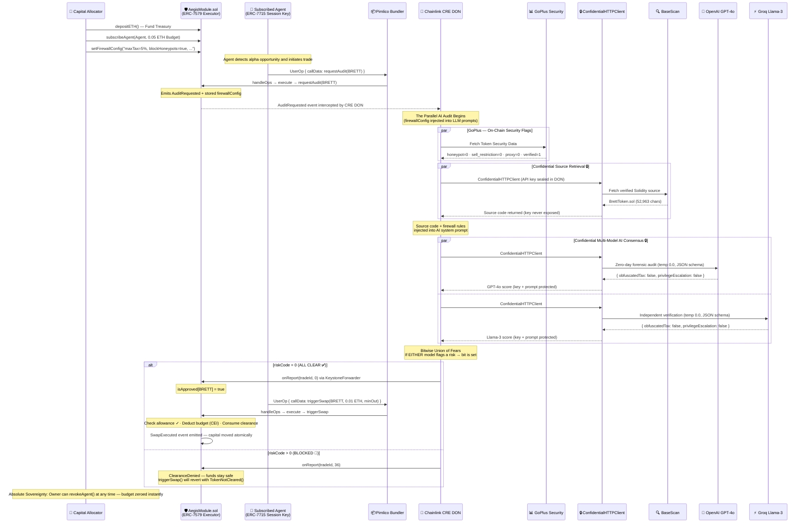

# 🛡️ Aegis Protocol V5: The Institutional AI Firewall

> **ERC-7579 Executor Module · Chainlink CRE Oracle · ERC-4337 Account Abstraction · ERC-7715 Session Keys (roadmap)**
>
> *Aegis is a zero-custody AI security firewall that installs onto your Smart Account and mathematically constrains what an autonomous AI agent can do with your capital.*

**Convergence Hackathon Tracks:** Risk & Compliance · CRE & AI · DeFi & Tokenization · Privacy · Autonomous Agents

[](test/AegisModule.t.sol)
[](test/)
[](cre-node/)
[](src/AegisModule.sol)
[](scripts/v5_e2e_mock.ts)

🎬 **[Watch the Demo Video](#)** · 📖 **[Architecture (7 Mermaid Diagrams)](docs/ARCHITECTURE.md)** · 🔐 **[Confidential HTTP Deep-Dive](docs/CONFIDENTIAL_HTTP.md)** · 🏆 **[Hackathon Proof Points](docs/HACKATHON_PROOF_POINTS.md)**

### Verified on Base Sepolia (Chain ID 84532)

| Contract | Address | Status |
|---|---|---|
| **AegisModule** (ERC-7579 Executor) | [`0x23EfaEF29EcC0e6CE313F0eEd3d5dA7E0f5Bcd89`](https://sepolia.basescan.org/address/0x23efaef29ecc0e6ce313f0eed3d5da7e0f5bcd89#code) | ✅ Verified on BaseScan |
| **Safe + SmartSessionValidator** | [`0xC006bfc3Cac01634168e9cD0a1fEbD4Ffb816e14`](https://sepolia.basescan.org/address/0xC006bfc3Cac01634168e9cD0a1fEbD4Ffb816e14) | ✅ ERC-7579 Validator installed |
| MockBRETT | [`0x46d40e0abda0814bb0cb323b2bb85a129d00b0ac`](https://sepolia.basescan.org/address/0x46d40e0abda0814bb0cb323b2bb85a129d00b0ac) | Deployed |
| MockHoneypot | [`0xf672c8fc888b98db5c9662d26e657417a3c453b5`](https://sepolia.basescan.org/address/0xf672c8fc888b98db5c9662d26e657417a3c453b5) | Deployed |

> **Owner:** [`0x109D8072B1762263ed094BC05c5110895Adc65Cf`](https://sepolia.basescan.org/address/0x109D8072B1762263ed094BC05c5110895Adc65Cf)

---

## 🛑 Stop Giving Trading Bots Your Private Keys.

AI trading bots are becoming mainstream. The problem? To use one today, you have to hand it your private keys and deposit your funds directly into a wallet it controls. If the bot gets it wrong — whether it's a honeypot token, a scam contract, or a compromised API key — your money is gone. No undo. No refund.

**Enter Aegis Protocol: A Zero-Trust Smart Treasury for AI.** Aegis is the security layer between your money and your AI agent. It completely separates the brain (the AI bot) from the bank (your money).

Think of it like issuing a corporate credit card to a new employee. The CEO (you) holds the primary bank account, and the employee (the AI Agent) gets a card with a strict $500 limit. If the employee tries to buy a yacht, the transaction is instantly declined. Aegis takes this a step further by routing every transaction through an automated, decentralized AI compliance department before a single cent leaves the vault.

### How it works:

- 🔐 **You Keep the Keys:** You lock your capital in a Safe Smart Account with the AegisModule installed. You retain absolute cryptographic custody.
- 💼 **You Set the Limits:** You "hire" AI agents by calling `subscribeAgent(agent, budget)`, granting them an on-chain allowance scoped to exactly two functions — `requestAudit()` and `triggerSwap()` — with a strict ETH budget. The agent *never touches your private keys*. (Production target: [ERC-7715 Session Keys](docs/ERC7579_ROADMAP.md))
- 🛡️ **The AI Firewall:** When an agent attempts a trade, Aegis intercepts the intent. It forces a Chainlink Decentralized Oracle Network to run multiple LLMs in parallel, forensically auditing the target token's live smart contract code for zero-day scams and logic bombs.
- ⚡ **Just-In-Time Execution:** If the token passes the firewall, the module executes the swap atomically — capital moves from treasury through the trade and back in a single transaction. If it fails, `TokenNotCleared()` reverts. **Zero capital at risk.**

*The bot does the thinking. You maintain custody.*

---

## V5 Architecture (Live on Base Sepolia)


```mermaid
sequenceDiagram
    participant Owner as 👤 Capital Allocator
    participant Module as 🛡️ AegisModule.sol<br/>(ERC-7579 Executor)
    participant Agent as 🤖 Subscribed Agent<br/>(ERC-7715 Session Key)
    participant Bundler as 📦 Pimlico Bundler
    participant Node as 🔮 Chainlink CRE DON
    participant GoPlus as 📊 GoPlus Security
    participant Enclave as 🔒 ConfidentialHTTPClient
    participant BaseScan as 🔍 BaseScan
    participant OpenAI as 🧠 OpenAI GPT-4o
    participant Groq as ⚡ Groq Llama-3

    Owner->>Module: depositETH() — Fund Treasury
    Owner->>Module: subscribeAgent(Agent, 0.05 ETH Budget)
    Owner->>Module: setFirewallConfig("maxTax=5%, blockHoneypots=true, ...")
    
    Note over Agent: Agent detects alpha opportunity and initiates trade

    Agent->>Bundler: UserOp { callData: requestAudit(BRETT) }
    Bundler->>Module: handleOps → execute → requestAudit(BRETT)
    Note over Module: Emits AuditRequested + stored firewallConfig

    Module-->>Node: AuditRequested event intercepted by CRE DON

    Note over Node: The Parallel AI Audit Begins<br/>(firewallConfig injected into LLM prompts)

    par GoPlus — On-Chain Security Flags
        Node->>GoPlus: Fetch Token Security Data
        GoPlus-->>Node: honeypot=0 · sell_restriction=0 · proxy=0 · verified=1
    end

    par Confidential Source Retrieval 🔒
        Node->>Enclave: ConfidentialHTTPClient (API key sealed in DON)
        Enclave->>BaseScan: Fetch verified Solidity source
        BaseScan-->>Enclave: BrettToken.sol (52,963 chars)
        Enclave-->>Node: Source code returned (key never exposed)
    end

    Note over Node: Source code + firewall rules<br/>injected into AI system prompt

    par Confidential Multi-Model AI Consensus 🔒
        Node->>Enclave: ConfidentialHTTPClient
        Enclave->>OpenAI: Zero-day forensic audit (temp 0.0, JSON schema)
        OpenAI-->>Enclave: { obfuscatedTax: false, privilegeEscalation: false }
        Enclave-->>Node: GPT-4o score (key + prompt protected)
    and
        Node->>Enclave: ConfidentialHTTPClient
        Enclave->>Groq: Independent verification (temp 0.0, JSON schema)
        Groq-->>Enclave: { obfuscatedTax: false, privilegeEscalation: false }
        Enclave-->>Node: Llama-3 score (key + prompt protected)
    end

    Note over Node: Bitwise Union of Fears<br/>If EITHER model flags a risk → bit is set

    alt riskCode = 0 (ALL CLEAR ✅)
        Node->>Module: onReport(tradeId, 0) via KeystoneForwarder
        Note over Module: isApproved[BRETT] = true
        Agent->>Bundler: UserOp { callData: triggerSwap(BRETT, 0.01 ETH, minOut) }
        Bundler->>Module: handleOps → execute → triggerSwap
        Note over Module: Check allowance ✓ · Deduct budget (CEI) · Consume clearance
        Module->>Module: SwapExecuted event emitted — capital moved atomically
    else riskCode > 0 (BLOCKED 🔴)
        Node->>Module: onReport(tradeId, 36)
        Note over Module: ClearanceDenied — funds stay safe<br/>triggerSwap() will revert with TokenNotCleared()
    end
    
    Note over Owner: Absolute Sovereignty: Owner can revokeAgent() at any time — budget zeroed instantly
```

---

## 🔬 Experimental: Bytecode Decompilation

> Aegis also ships with a standalone **Heimdall bytecode decompilation pipeline** that can analyze contracts with no verified source code. This is a proof-of-concept demo — not yet wired into the live CRE oracle. See **[Heimdall Pipeline (full docs)](docs/HEIMDALL_PIPELINE.md)** for details, demo scripts, and live test results.

---

## 🖥️ Frontend Dashboard

Aegis ships with a **Next.js 3-panel command center** that lets you manage agents, configure the firewall, trigger live oracle audits, and monitor results in real time.

| Panel | Purpose |
|---|---|
| **Left — Agents / Firewall / Marketplace** | Manage subscribed agents (subscribe, revoke, trade), toggle 8-bit firewall risk toggles, browse pre-built trading strategies |
| **Center — AI Chat** | Natural language interface to query treasury balance, list agents, or trigger audits ("audit BRETT") |
| **Right — Oracle Feed** | Real-time SSE stream showing GoPlus → BaseScan → GPT-4o → Llama-3 → Verdict with on-chain explorer links |

**Key Features:**
- 🔴 **Kill Switch** — one-click protocol lock that halts all agentic outflow and severs Smart Account connections
- 🎯 **Drag-to-Resize** — adjustable panel widths for any screen size
- 🏪 **Agent Marketplace** — 5 pre-built strategies (BLUECHIP, YIELD, DEGEN, SAFE, HEIMDALL) with color-coded risk badges

> **UI Test Matrix:** [`docs/UI_TEST_MATRIX.md`](docs/UI_TEST_MATRIX.md) — 50 automated test cases across 10 categories

---

## 🔐 How Aegis Works (The 3-Step Firewall)

### Step 1 — The Vault (ERC-4337 + ERC-7579)
Your capital lives in a **Safe Smart Account** with the **AegisModule** installed as an ERC-7579 Executor. You hire AI agents by calling `subscribeAgent(agent, budget)` — granting an on-chain allowance scoped to 2 functions (`requestAudit()` and `triggerSwap()`) with a strict ETH budget. The production evolution uses **ERC-7715 Session Keys** for agent-signed UserOps (see [roadmap](docs/ERC7579_ROADMAP.md)).

### Step 2 — The Intent (Chainlink CRE)
When an agent spots a trade opportunity, it calls `requestAudit(token)`. The Chainlink CRE DON intercepts the event and runs a multi-phase AI audit inside a WASM sandbox:
- **GoPlus** — static on-chain security flags (honeypot, sell restriction, proxy)
- **BaseScan** — source code retrieval via `ConfidentialHTTPClient`
- **GPT-4o + Llama-3** — dual-model forensic consensus producing an 8-bit risk verdict

### Step 3 — The Execution (or Hard Block)
- `riskCode == 0` → `triggerSwap()` is unblocked. Capital moves atomically in a single transaction.
- `riskCode > 0` → `ClearanceDenied` emitted. `triggerSwap()` reverts with `TokenNotCleared()`. **Zero capital at risk.**

> For the full architecture with 7 Mermaid diagrams, see [ARCHITECTURE.md](docs/ARCHITECTURE.md).

---

## 📊 The 8-Bit Risk Matrix

| Bit | Flag | Source |
|---|---|---|
| 0 | Unverified source code | GoPlus |
| 1 | Sell restriction | GoPlus |
| 2 | Honeypot | GoPlus |
| 3 | Proxy contract | GoPlus |
| 4 | Obfuscated tax | AI (GPT-4o + Llama-3) |
| 5 | Privilege escalation / transfer allowlist honeypot | AI |
| 6 | External call risk | AI |
| 7 | Logic bomb | AI |

The oracle uses a bitwise **"Union of Fears"** — if *either* AI model flags a risk, the corresponding bit is set. Each bit is also gated by the owner's on-chain firewall config (8 toggles + maxTax slider). Details in [ARCHITECTURE.md](docs/ARCHITECTURE.md).

> **Experimental:** A standalone [Heimdall bytecode decompilation pipeline](docs/HEIMDALL_PIPELINE.md) extends coverage to unverified contracts by decompiling raw EVM bytecode.

---

## 🔗 Files Using Chainlink

> **Hackathon requirement:** The README must link to all files that use Chainlink.

| File | Role |
|---|---|
| [`cre-node/aegis-oracle.ts`](cre-node/aegis-oracle.ts) | CRE WASM Oracle — GoPlus + BaseScan + GPT-4o + Llama-3 via ConfidentialHTTPClient |
| [`cre-node/workflow.yaml`](cre-node/workflow.yaml) | CRE workflow definition (target, RPC, artifact paths) |
| [`cre-node/workflow.ts`](cre-node/workflow.ts) | CRE entry point — re-exports main from aegis-oracle.ts |
| [`cre-node/config.json`](cre-node/config.json) | CRE node config (AegisModule address) |
| [`cre-node/secrets.yaml`](cre-node/secrets.yaml) | Secret ID references for DON vault |
| [`cre-node/Dockerfile`](cre-node/Dockerfile) | Docker container for CRE node + Javy WASM compilation |
| [`src/AegisModule.sol`](src/AegisModule.sol) | ERC-7579 Executor — `onReport()` callback from CRE oracle |
| [`test/oracle.spec.ts`](test/oracle.spec.ts) | Oracle unit tests (risk matrix, AI JSON parsing) |
| [`aegis-frontend/app/api/audit/route.ts`](aegis-frontend/app/api/audit/route.ts) | Frontend API: full CRE pipeline + `onReportDirect()` |
| [`aegis-frontend/app/components/OracleFeed.tsx`](aegis-frontend/app/components/OracleFeed.tsx) | UI: SSE stream consumer for live CRE output |
| [`scripts/demo_v5_cre.ps1`](scripts/demo_v5_cre.ps1) | CRE WASM compile + `cre workflow simulate` demo |
| [`scripts/demo_v5_master.ps1`](scripts/demo_v5_master.ps1) | Full E2E: `requestAudit()` → CRE → `onReportDirect()` → `triggerSwap()` |

---

## 🎬 Demo Scripts

> **Three cinematic PowerShell scripts with interactive ActIntro scene introductions.**

```powershell
# Act 0: Boot infrastructure (Docker, WASM compile, Base Sepolia connectivity)
.\scripts\demo_v5_setup.ps1 -Interactive

# Act 1-7: Full live E2E (treasury → subscribe agents → audit → CRE → swap/revert → budget → kill switch)
.\scripts\demo_v5_master.ps1 -Interactive

# CRE-only showcase for Chainlink judges
.\scripts\demo_v5_cre.ps1 -Interactive
```

### [`demo_v5_setup.ps1`](scripts/demo_v5_setup.ps1) — Infrastructure Boot (~2 min) · [sample output](docs/sample_output/demo_v5_setup_run.txt)
- Verifies Base Sepolia connectivity (Chain ID 84532)
- Checks deployer wallet balance
- Rebuilds Chainlink CRE Docker container
- Compiles TypeScript oracle to WASM via Javy

### [`demo_v5_master.ps1`](scripts/demo_v5_master.ps1) — End-to-End Showcase (~5 min) · [sample output](docs/sample_output/demo_v5_master_run.txt)

| Act | Title | What Happens |
|---|---|---|
| 1 — The Bank | Zero-Custody Treasury | `cast balance` shows AegisModule holds 0 ETH — capital is in the Safe |
| 2 — The Keys | Subscribe AI Agents | `subscribeAgent(NOVA, 0.05 ETH)` + `subscribeAgent(CIPHER, 0.008 ETH)` on-chain |
| 3 — The Intents | Agent NOVA submits audits | `requestAudit` for MockBRETT + MockHoneypot on Base Sepolia |
| 4 — The AI Firewall | **LIVE CRE Execution** | `docker exec cre workflow simulate` — GoPlus → BaseScan → GPT-4o + Llama-3 |
| 5 — The Execution | The Final Verdict | MockBRETT swap ✅ SUCCESS, MockHoneypot swap ❌ `TokenNotCleared()` REVERT |
| 6 — Budget Check | Verify Deduction | `agentAllowances()` proves budget was mathematically deducted |
| 7 — Kill Switch | Revoke Agent REX | `revokeAgent(REX)` → budget zeroed, access denied, sovereignty restored |

### [`demo_v5_cre.ps1`](scripts/demo_v5_cre.ps1) — CRE Deep Dive (~3 min) · [sample output](docs/sample_output/demo_v5_cre_run.txt)
Raw Chainlink CRE WASM execution for CRE & AI judges. No frontend, no abstraction — just the oracle analyzing a known honeypot with full color-coded log streaming.

### Sample Output (from actual runs on Base Sepolia)

| File | What It Shows |
|---|---|
| [`forge_tests.txt`](docs/sample_output/forge_tests.txt) | 21 Solidity tests passing |
| [`jest_tests.txt`](docs/sample_output/jest_tests.txt) | 92 TypeScript tests passing across 8 suites |
| [`demo_v5_setup_run.txt`](docs/sample_output/demo_v5_setup_run.txt) | Infrastructure boot |
| [`demo_v5_master_run.txt`](docs/sample_output/demo_v5_master_run.txt) | Full 7-act lifecycle with live CRE AI |
| [`demo_v5_cre_run.txt`](docs/sample_output/demo_v5_cre_run.txt) | Raw CRE WASM execution |

---

## ⚡ Quickstart

### Prerequisites
- [Foundry](https://book.getfoundry.sh/) (`forge`, `cast`)
- [pnpm](https://pnpm.io/)
- [Docker Desktop](https://www.docker.com/products/docker-desktop/)
- Base Sepolia ETH (~0.05 ETH for gas)
- Pimlico API key (free tier)

### 1. Install dependencies
```bash
pnpm install
```

### 2. Run smart contract tests
```bash
forge test --match-contract AegisModuleTest -vv
# Expected: 21 passed, 0 failed
```

### 3. Run TypeScript tests
```bash
pnpm exec jest
# Expected: 92 passed, 1 skipped
```

### 4. Configure Environment
```bash
cp .env.example .env   # Fill in all values below
```

#### Required API Keys

| # | Variable | Where to Get | Used By |
|---|---|---|---|
| 1 | `PRIVATE_KEY` | Your wallet (MetaMask → Account Details → Private Key) | All scripts |
| 2 | `PIMLICO_API_KEY` | [dashboard.pimlico.io](https://dashboard.pimlico.io) (free) | ERC-4337 UserOps |
| 3 | `BASESCAN_API_KEY` | [basescan.org/myapikey](https://basescan.org/myapikey) | CRE oracle (source fetch) |
| 4 | `OPENAI_API_KEY` | [platform.openai.com](https://platform.openai.com) | CRE oracle (GPT-4o) |
| 5 | `GROQ_API_KEY` | [console.groq.com](https://console.groq.com) (free) | CRE oracle (Llama-3) |
| 6 | `GOPLUS_APP_KEY` | [developer.gopluslabs.io](https://developer.gopluslabs.io) | CRE oracle (optional) |

#### Deployed Addresses (Base Sepolia)

| Contract | Address | BaseScan |
|---|---|---|
| **AegisModule** | `0x23EfaEF29EcC0e6CE313F0eEd3d5dA7E0f5Bcd89` | [✅ Verified](https://sepolia.basescan.org/address/0x23efaef29ecc0e6ce313f0eed3d5da7e0f5bcd89#code) |
| **MockBRETT** | `0x46d40e0aBdA0814bb0CB323B2Bb85a129d00B0AC` | [View](https://sepolia.basescan.org/address/0x46d40e0aBdA0814bb0CB323B2Bb85a129d00B0AC) |
| **MockHoneypot** | `0xf672c8fc888b98db5c9662d26e657417a3c453b5` | [View](https://sepolia.basescan.org/address/0xf672c8fc888b98db5c9662d26e657417a3c453b5) |
| **Owner** | `0x109D8072B1762263ed094BC05c5110895Adc65Cf` | [View](https://sepolia.basescan.org/address/0x109D8072B1762263ed094BC05c5110895Adc65Cf) |

> **MetaMask:** Add Base Sepolia as a custom network (Chain ID `84532`, RPC `https://sepolia.base.org`). Import the owner wallet with your private key.
>
> **app.safe.global:** Connect your MetaMask wallet on Base Sepolia. The Safe Smart Account is deployed via `v5_setup_safe.ts` and the AegisModule is installed as an Executor module.

### 5. Deploy to Base Sepolia (if redeploying)
```bash
forge script script/DeployMocks.s.sol:DeployMocks \
  --rpc-url https://sepolia.base.org --private-key $PRIVATE_KEY --broadcast
```

### 6. Launch the CRE Oracle Node
```bash
docker compose up --build -d
# Watch for: ✅ CRE TS SDK is ready to use.
```

### 7. Run the cinematic demo
```powershell
.\scripts\demo_v5_setup.ps1 -Interactive
.\scripts\demo_v5_master.ps1 -Interactive
```

---

## 📋 AegisModule Function Reference

Every on-chain transaction maps to one of these functions on [`AegisModule.sol`](src/AegisModule.sol):

| Function | Who Can Call | What It Does |
|---|---|---|
| `depositETH()` | Owner | Deposits raw ETH into the module treasury. |
| `subscribeAgent(address, uint256)` | Owner | Grants an agent wallet permission to trade, with a strict ETH budget cap. |
| `revokeAgent(address)` | Owner | Instantly zeros the agent's budget and deauthorizes it. |
| `withdrawETH(uint256)` | Owner | Withdraws ETH from the treasury back to the owner. |
| `withdrawERC20(address, uint256)` | Owner | Withdraws any ERC-20 tokens held in the module. |
| `setFirewallConfig(string)` | Owner | Sets the vault-wide AI firewall policy. Rules are stored on-chain and automatically applied to every audit. |
| `requestAudit(address)` | Owner or Agent | Submits a trade intent. Emits `AuditRequested` with the stored `firewallConfig` — the CRE DON reads this and applies the owner's rules. |
| `onReport(bytes, bytes)` | KeystoneForwarder | Production CRE callback. Decodes `(tradeId, riskCode)` and approves or denies. |
| `onReportDirect(uint256, uint256)` | Forwarder or Owner | Demo relay. Simplified entry point accepting `(tradeId, riskScore)` directly. |
| `triggerSwap(address, uint256, uint256)` | Owner or Agent | JIT execution. Requires the token to be cleared (`isApproved[token] == true`), deducts amount from agent budget. Clearance is consumed (one-time use). |

---


---

## 🖥️ Agentic Command Center (`/aegis-frontend`)

A split-stream dashboard where the human monitors their fleet:

| Tab | Function |
|---|---|
| **Agents** | Subscribe/revoke agents, budget bars, quick-audit trigger |
| **Firewall** | 8-bit risk toggle matrix + threshold sliders |
| **Audit Log** | On-chain event log with filter + decoded risk bits |
| **Marketplace** | Preset agent strategies with Deploy button |
| **Oracle Feed** | Always-visible SSE stream: GoPlus → AI → verdict |

```powershell
cd aegis-frontend
npm install
npm run dev
# http://localhost:3000
```

---

## 🏗️ Architecture

See [docs/ARCHITECTURE.md](docs/ARCHITECTURE.md) for the full deep-dive with 12 Mermaid diagrams.

| Layer | Technology | Role |
|---|---|---|
| Smart Account | ERC-4337 (Safe) | Holds all capital |
| Session Key | ERC-7715 (roadmap) | Agent signing authority — config built, validator installed, [full signing pending](docs/ERC7579_ROADMAP.md) |
| Security Module | ERC-7579 Executor | `AegisModule.sol` — this repo |
| Oracle | Chainlink CRE DON | Off-chain AI audit + on-chain callback |
| Bundler | Pimlico Cloud | ERC-4337 UserOp relay + paymaster |

---

## 🛠️ Project Structure

| Directory | Description |
|---|---|
| `/src` | Solidity source — [`AegisModule.sol`](src/AegisModule.sol) (ERC-7579 Executor) |
| `/cre-node` | Chainlink CRE workflow — [`aegis-oracle.ts`](cre-node/aegis-oracle.ts), `workflow.yaml` |
| `/scripts` | Demo scripts, AA config modules, E2E mock test |
| `/test` | Forge + Jest test suites (21 + 99 = 120 core tests) |
| `/aegis-frontend` | Next.js Agentic Command Center — chat, oracle feed, firewall UI |
| `/docs` | Architecture, Confidential HTTP, Demo Guide, sample outputs |
| `/script` | Foundry deployment scripts (`DeployMocks.s.sol`) |

---

## 🤖 AI Stack Acknowledgment

| Layer | Technology | Role |
|---|---|---|
| **Protocol Infrastructure** | OpenAI GPT-4o, Groq Llama-3 | Deep forensics + parallel consensus inside CRE WASM |
| **Development** | Google Antigravity, Gemini, Claude | Agent-first IDE for rapid Web3 development |
| **Media & Presentation** | Google NotebookLM, Veo 3 | Infographics, narrative video interstitials, cinematic B-roll |

---

## 📚 Deep Dives & Hackathon Judging

| Document | Content |
|---|---|
| 🏆 [**Hackathon Proof Points**](docs/HACKATHON_PROOF_POINTS.md) | All 5 track requirement mappings, test evidence, on-chain contracts |
| 📖 [**Architecture**](docs/ARCHITECTURE.md) | 7 Mermaid diagrams — CRE pipeline, trade lifecycle, ERC-4337 flow |
| 🔐 [**Confidential HTTP**](docs/CONFIDENTIAL_HTTP.md) | Privacy track deep-dive — how all API keys are sealed inside DON |
| 🧠 [**AI Prompt Catalog**](docs/AI_PROMPT_CATALOG.md) | All 3 AI prompts with templates and design rationale |
| 🎬 [**Demo Guide**](docs/DEMO_GUIDE.md) | How to run all demo scripts |
| 🔬 [Heimdall Pipeline](docs/HEIMDALL_PIPELINE.md) | *(Experimental)* Bytecode decompilation for unverified contracts |
| 💰 [x402 Monetization](docs/X402_MONETIZATION.md) | *(Experimental)* Paid oracle API via x402 payment protocol |

---

## 🔗 External References

- [Chainlink CRE Docs](https://docs.chain.link/cre)
- [Rhinestone ModuleKit](https://docs.rhinestone.wtf)
- [ERC-7579 Standard](https://eips.ethereum.org/EIPS/eip-7579)
- [Smart Contract](src/AegisModule.sol)
- [CRE Oracle](cre-node/aegis-oracle.ts)
