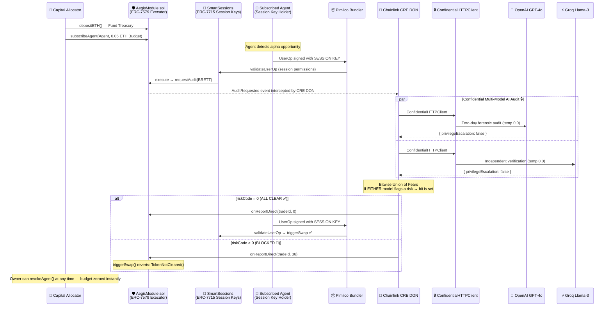

# 🛡️ Aegis Protocol V5: The Institutional AI Firewall

> **ERC-7579 Module · ERC-7715 Session Keys · Chainlink CRE Oracle · ERC-4337 Account Abstraction**
>
> *Aegis is a zero-custody AI security firewall built as an ERC-7579 module that mathematically constrains what an autonomous AI agent can do with your capital.*

**Convergence Hackathon Tracks:** Risk & Compliance · CRE & AI · DeFi & Tokenization · Privacy · Autonomous Agents

[](cre-node/)
[](src/AegisModule.sol)
[](scripts/v5_session_utils.ts)
[](scripts/v5_e2e_mock.ts)
[](test/)

🎬 **[Watch the Demo Video](#)** · 📖 **[Architecture](docs/ARCHITECTURE.md)** · 🔐 **[Confidential HTTP](docs/CONFIDENTIAL_HTTP.md)** · 🏆 **[Hackathon Proof Points](docs/HACKATHON_PROOF_POINTS.md)**

### Verified on Base Sepolia (Chain ID 84532)

| Contract | Address | Status |
|---|---|---|
| **AegisModule** (ERC-7579 Executor) | [`0x23EfaEF29EcC0e6CE313F0eEd3d5dA7E0f5Bcd89`](https://sepolia.basescan.org/address/0x23efaef29ecc0e6ce313f0eed3d5da7e0f5bcd89#code) | ✅ Verified |
| **Safe + SmartSessions** | [`0xb9ff55a887727AeF9C56e7b76101693226eA9a91`](https://sepolia.basescan.org/address/0xb9ff55a887727AeF9C56e7b76101693226eA9a91) | ✅ Session Keys Active |

> **Owner:** [`0x109D8072B1762263ed094BC05c5110895Adc65Cf`](https://sepolia.basescan.org/address/0x109D8072B1762263ed094BC05c5110895Adc65Cf)

---

## 🛑 Stop Giving Trading Bots Your Private Keys.

AI trading bots are becoming mainstream. The problem? You have to hand over your private keys. If the bot gets it wrong — honeypot token, scam contract, compromised API — your money is gone.

**Aegis is the security layer between your money and your AI agent.** Think of it like issuing a corporate credit card to a new employee: the CEO (you) holds the bank account, the employee (the AI agent) gets a card with a strict $500 limit. Aegis goes further — routing every transaction through a decentralized AI compliance department before a single cent leaves the vault.

### How it works:

- 🔐 **You Keep the Keys:** Capital lives in a Safe Smart Account. You retain absolute custody.
- 💼 **You Set the Limits:** `subscribeAgent(agent, budget)` grants an on-chain ETH budget. Exceeding it reverts.
- 🔑 **Session Keys:** Agent submits UserOps via ERC-7715 session key — owner's private key never used. ([proof](docs/sample_output/session_key_demo.txt))
- 🛡️ **The AI Firewall:** Chainlink DON runs dual LLMs in parallel, forensically auditing target tokens for zero-day scams.
- ⚡ **Per-Trade AI Clearance:** Cleared → swap executes. Failed → `TokenNotCleared()` reverts on-chain. **Zero capital at risk.**

> **Testnet note:** On Base Sepolia, `triggerSwap` emits `SwapExecuted` but does not route through a real DEX (no liquidity). Production Uniswap V3 code is included in the contract, commented out. Budget enforcement and clearance checks are fully real.

### Raw Output (no formatting — just facts)

| Script | What it proves | Output |
|---|---|---|
| `raw_master.ps1` | Full lifecycle: subscribe → session key audit → CRE oracle → swap/revert → budget → kill switch | [raw_master_run.txt](docs/sample_output/raw_master_run.txt) |
| `raw_cre.ps1` | CRE WASM pipeline: GoPlus + BaseScan + GPT-4o + Llama-3 consensus | [raw_cre_run.txt](docs/sample_output/raw_cre_run.txt) |
| `raw_heimdall.ps1` | Bytecode decompilation: eth_getCode → Heimdall → GPT-4o risk analysis | [raw_heimdall_run.txt](docs/sample_output/raw_heimdall_run.txt) |
| `raw_setup.ps1` | Infrastructure: chain ID, wallet, Docker, WASM compilation | [raw_setup_run.txt](docs/sample_output/raw_setup_run.txt) |


## V5 Architecture (Live on Base Sepolia)


```mermaid
sequenceDiagram
    participant Owner as 👤 Capital Allocator
    participant Module as 🛡️ AegisModule.sol<br/>(ERC-7579 Executor)
    participant Sessions as 🔑 SmartSessions<br/>(ERC-7715 Session Keys)
    participant Agent as 🤖 Subscribed Agent<br/>(Session Key Holder)
    participant Bundler as 📦 Pimlico Bundler
    participant Node as 🔮 Chainlink CRE DON
    participant Enclave as 🔒 ConfidentialHTTPClient
    participant OpenAI as 🧠 OpenAI GPT-4o
    participant Groq as ⚡ Groq Llama-3

    Owner->>Module: depositETH() — Fund Treasury
    Owner->>Module: subscribeAgent(Agent, 0.05 ETH Budget)
    
    Note over Agent: Agent detects alpha opportunity

    Agent->>Bundler: UserOp signed with SESSION KEY
    Bundler->>Sessions: validateUserOp (session permissions)
    Sessions->>Module: execute → requestAudit(BRETT)
    Module-->>Node: AuditRequested event intercepted by CRE DON

    par Confidential Multi-Model AI Audit 🔒
        Node->>Enclave: ConfidentialHTTPClient
        Enclave->>OpenAI: Zero-day forensic audit (temp 0.0)
        OpenAI-->>Node: { privilegeEscalation: false }
    and
        Node->>Enclave: ConfidentialHTTPClient
        Enclave->>Groq: Independent verification (temp 0.0)
        Groq-->>Node: { privilegeEscalation: false }
    end

    Note over Node: Bitwise Union of Fears<br/>If EITHER model flags a risk → bit is set

    alt riskCode = 0 (ALL CLEAR ✅)
        Node->>Module: onReportDirect(tradeId, 0)
        Agent->>Bundler: UserOp signed with SESSION KEY
        Bundler->>Sessions: validateUserOp → triggerSwap ✅
    else riskCode > 0 (BLOCKED 🔴)
        Node->>Module: onReportDirect(tradeId, 36)
        Note over Module: triggerSwap() reverts: TokenNotCleared()
    end
    
    Note over Owner: Owner can revokeAgent() at any time — budget zeroed instantly
```

> For the full architecture, see [ARCHITECTURE.md](docs/ARCHITECTURE.md).

---

## 📊 The 8-Bit Risk Matrix

| Bit | Flag | Source |
|---|---|---|
| 0 | Unverified source code | GoPlus |
| 1 | Sell restriction | GoPlus |
| 2 | Honeypot | GoPlus |
| 3 | Proxy contract | GoPlus |
| 4 | Obfuscated tax | AI (GPT-4o + Llama-3) |
| 5 | Privilege escalation | AI |
| 6 | External call risk | AI |
| 7 | Logic bomb | AI |

The oracle uses a bitwise **"Union of Fears"** — if *either* AI model flags a risk, the corresponding bit is set. Each bit is gated by the owner's on-chain firewall config (`setFirewallConfig()`) — the CRE oracle parses it from the `AuditRequested` event and applies the owner's toggles to every risk check.

---

## 🎬 Demo Scripts

```powershell
.\scripts\demo_v5_setup.ps1 -Interactive    # Infrastructure boot (~2 min)
.\scripts\demo_v5_master.ps1 -Interactive    # Full E2E lifecycle (~5 min)
.\scripts\demo_v5_cre.ps1 -Interactive       # CRE deep dive for Chainlink judges (~3 min)
```

> Full walkthrough, sample output, and troubleshooting: **[Demo Guide](docs/DEMO_GUIDE.md)**

---

## 🔗 Files Using Chainlink

> **Hackathon requirement:** The README must link to all files that use Chainlink.

| File | Role |
|---|---|
| [`cre-node/aegis-oracle.ts`](cre-node/aegis-oracle.ts) | CRE WASM Oracle — GoPlus + BaseScan + GPT-4o + Llama-3 via ConfidentialHTTPClient |
| [`cre-node/workflow.yaml`](cre-node/workflow.yaml) | CRE workflow definition (target, RPC, artifact paths) |
| [`cre-node/workflow.ts`](cre-node/workflow.ts) | CRE entry point — re-exports main from aegis-oracle.ts |
| [`cre-node/config.json`](cre-node/config.json) | CRE node config (AegisModule address) |
| [`cre-node/secrets.yaml`](cre-node/secrets.yaml) | Secret ID references for DON vault |
| [`cre-node/Dockerfile`](cre-node/Dockerfile) | Docker container for CRE node + Javy WASM compilation |
| [`src/AegisModule.sol`](src/AegisModule.sol) | ERC-7579 Executor — `onReport()` callback from CRE oracle |
| [`test/oracle.spec.ts`](test/oracle.spec.ts) | Oracle unit tests (risk matrix, AI JSON parsing) |
| [`aegis-frontend/app/api/audit/route.ts`](aegis-frontend/app/api/audit/route.ts) | Frontend API: full CRE pipeline + `onReportDirect()` |
| [`aegis-frontend/app/components/OracleFeed.tsx`](aegis-frontend/app/components/OracleFeed.tsx) | UI: SSE stream consumer for live CRE output |
| [`scripts/demo_v5_cre.ps1`](scripts/demo_v5_cre.ps1) | CRE demo script |
| [`scripts/demo_v5_master.ps1`](scripts/demo_v5_master.ps1) | Full E2E demo (session key UserOps) |
| [`scripts/v5_session_utils.ts`](scripts/v5_session_utils.ts) | Session key utility — Safe creation with SmartSessions, scoped agent permissions |

---

## ⚡ Quickstart

```bash
# 1. Install
pnpm install

# 2. Test
forge test --match-contract AegisModuleTest -vv && pnpm exec jest

# 3. Configure
cp .env.example .env   # Fill: PRIVATE_KEY, AGENT_PRIVATE_KEY, PIMLICO_API_KEY, OPENAI_API_KEY, GROQ_API_KEY, BASESCAN_API_KEY

# 4. Launch CRE Oracle
docker compose up --build -d

# 5. Run the demo
.\scripts\demo_v5_setup.ps1 -Interactive
.\scripts\demo_v5_master.ps1 -Interactive

# 6. Launch frontend
cd aegis-frontend && npm run dev
```

---

## 📋 AegisModule Function Reference

| Function | Access | Purpose |
|---|---|---|
| `depositETH()` | Owner | Fund the module treasury |
| `subscribeAgent(addr, budget)` | Owner | Grant agent a scoped ETH budget |
| `revokeAgent(addr)` | Owner | Instantly zero agent's budget |
| `requestAudit(token)` | Owner/Agent | Submit trade intent → emits `AuditRequested` |
| `onReport(bytes, bytes)` | KeystoneForwarder | Production CRE callback (demo uses `onReportDirect`) |
| `triggerSwap(token, amount, minOut)` | Owner/Agent | Execute swap if token cleared by oracle + budget allows |
| `setFirewallConfig(config)` | Owner | Set vault-wide AI firewall policy |
| `withdrawETH(amount)` | Owner | Withdraw ETH to owner |

---

## 📚 Deep Dives

| Document | Content |
|---|---|
| 🏆 [**Hackathon Proof Points**](docs/HACKATHON_PROOF_POINTS.md) | Track requirement mappings, test evidence, on-chain contracts |
| 📖 [**Architecture**](docs/ARCHITECTURE.md) | Mermaid diagrams — CRE pipeline, trade lifecycle, ERC-4337 flow |
| 🔐 [**Confidential HTTP**](docs/CONFIDENTIAL_HTTP.md) | Privacy track — how API keys are sealed inside DON |
| 🧠 [**AI Prompt Catalog**](docs/AI_PROMPT_CATALOG.md) | All AI prompts with templates and design rationale |
| 🎬 [**Demo Guide**](docs/DEMO_GUIDE.md) | How to run demos + sample output |
| 🖥️ [**Frontend**](aegis-frontend/README.md) | Next.js dashboard — agents, firewall toggles, oracle feed, chat |
| 🔬 [**Heimdall Pipeline**](docs/HEIMDALL_PIPELINE.md) | *(Experimental)* Bytecode decompilation for unverified contracts |
| 📝 [**Lessons Learned**](docs/LESSONS_LEARNED.md) | Engineering ledger |

---

## 🤖 AI Acknowledgment

**Protocol:** GPT-4o + Llama-3 (CRE WASM) · **Development:** Google Antigravity, Gemini, Claude · **Media:** NotebookLM, Veo 3

---

## 🔗 References

- [Chainlink CRE Docs](https://docs.chain.link/cre) · [Rhinestone ModuleKit](https://docs.rhinestone.wtf) · [ERC-7579](https://eips.ethereum.org/EIPS/eip-7579)
- [Smart Contract](src/AegisModule.sol) · [CRE Oracle](cre-node/aegis-oracle.ts)
