# 🛡️ Aegis Protocol V5: The Institutional AI Firewall

> **ERC-7579 Executor Module · Chainlink CRE Oracle · ERC-4337 Account Abstraction · ERC-7715 Session Keys**
>
> *Aegis is a zero-custody AI security firewall that installs onto your Smart Account and mathematically constrains what an autonomous AI agent can do with your capital.*

**Convergence Hackathon Tracks:** Risk & Compliance · CRE & AI · DeFi & Tokenization · Privacy · Autonomous Agents

[](test/AegisModule.t.sol)
[](test/)
[](cre-node/)
[](src/AegisModule.sol)
[](scripts/v5_e2e_mock.ts)

🎬 **[Watch the Demo Video](#)** · 📖 **[Architecture (12 Mermaid Diagrams)](docs/ARCHITECTURE.md)** · 🔐 **[Confidential HTTP Deep-Dive](docs/CONFIDENTIAL_HTTP.md)** · 🏗️ **[ERC Standards (4337 + 7579 + 7715)](docs/ERC_STANDARDS.md)**

### Verified on Base Sepolia (Chain ID 84532)

| Contract | Address | Status |
|---|---|---|
| **AegisModule** (ERC-7579 Executor) | [`0x23EfaEF29EcC0e6CE313F0eEd3d5dA7E0f5Bcd89`](https://sepolia.basescan.org/address/0x23efaef29ecc0e6ce313f0eed3d5da7e0f5bcd89#code) | ✅ Verified on BaseScan |
| MockBRETT | [`0x46d40e0abda0814bb0cb323b2bb85a129d00b0ac`](https://sepolia.basescan.org/address/0x46d40e0abda0814bb0cb323b2bb85a129d00b0ac) | Deployed |
| MockHoneypot | [`0xf672c8fc888b98db5c9662d26e657417a3c453b5`](https://sepolia.basescan.org/address/0xf672c8fc888b98db5c9662d26e657417a3c453b5) | Deployed |

> **Owner:** [`0x109D8072B1762263ed094BC05c5110895Adc65Cf`](https://sepolia.basescan.org/address/0x109D8072B1762263ed094BC05c5110895Adc65Cf)

---

## 🛑 Stop Giving Trading Bots Your Private Keys.

AI trading bots are becoming mainstream. The problem? To use one today, you have to hand it your private keys and deposit your funds directly into a wallet it controls. If the bot gets it wrong — whether it's a honeypot token, a scam contract, or a compromised API key — your money is gone. No undo. No refund.

**Enter Aegis Protocol: A Zero-Trust Smart Treasury for AI.** Aegis is the security layer between your money and your AI agent. It completely separates the brain (the AI bot) from the bank (your money).

Think of it like issuing a corporate credit card to a new employee. The CEO (you) holds the primary bank account, and the employee (the AI Agent) gets a card with a strict $500 limit. If the employee tries to buy a yacht, the transaction is instantly declined. Aegis takes this a step further by routing every transaction through an automated, decentralized AI compliance department before a single cent leaves the vault.

### How it works:

- 🔐 **You Keep the Keys:** You lock your capital in a Safe Smart Account with the AegisModule installed. You retain absolute cryptographic custody.
- 💼 **You Set the Limits:** You "hire" AI agents by granting them an ERC-7715 Session Key scoped to exactly two functions — `requestAudit()` and `triggerSwap()` — with a strict ETH budget. The agent *never touches your private keys*.
- 🛡️ **The AI Firewall:** When an agent attempts a trade, Aegis intercepts the intent. It forces a Chainlink Decentralized Oracle Network to run multiple LLMs in parallel, forensically auditing the target token's live smart contract code for zero-day scams and logic bombs.
- ⚡ **Just-In-Time Execution:** If the token passes the firewall, the module executes the swap atomically — capital moves from treasury through the trade and back in a single transaction. If it fails, `TokenNotCleared()` reverts. **Zero capital at risk.**

*The bot does the thinking. You maintain custody.*

---

## V5 Architecture (Live on Base Sepolia)

```mermaid
graph TD
    Agent["🤖 AI Agent<br/>ERC-7715 session key — scoped to requestAudit + triggerSwap only"]
    Bundler["📦 Pimlico Cloud Bundler<br/>gas estimation · paymaster · EntryPoint submission"]
    EP["🔗 ERC-4337 EntryPoint 0.7<br/>on Base Sepolia"]
    Safe["💰 Safe Smart Account<br/>ERC-7579 — AegisModule installed as Executor"]
    CRE["🔮 Chainlink CRE DON<br/>GoPlus · BaseScan ConfidentialHTTP · GPT-4o + Llama-3"]
    Swap["✅ triggerSwap → Swap executes"]
    Deny["🔴 ClearanceDenied — capital preserved"]

    Agent -->|"sendUserOperation()"| Bundler
    Bundler -->|"handleOps"| EP
    EP -->|"execute"| Safe
    Safe -->|"requestAudit(token)"| CRE
    CRE -->|"onReport(tradeId, riskScore)"| Safe
    Safe -->|"riskScore == 0"| Swap
    Safe -->|"riskScore > 0"| Deny

    style Agent fill:#e3f2fd,stroke:#1565c0,color:#0d47a1
    style Bundler fill:#e0f2f1,stroke:#00796b,color:#004d40
    style EP fill:#e0f2f1,stroke:#00796b,color:#004d40
    style Safe fill:#fff3e0,stroke:#e65100,color:#bf360c
    style CRE fill:#f3e5f5,stroke:#6a1b9a,color:#4a148c
    style Swap fill:#e8f5e9,stroke:#2e7d32,color:#1b5e20
    style Deny fill:#ffebee,stroke:#c62828,color:#b71c1c
```



---

## 🏗️ The Separation of Identity and Capital

The fundamental security philosophy of Aegis is the strict separation of **Execution Identity** and **Trading Capital**. The protocol relies on three distinct actors:

### 1. The Capital Allocator (The Human Owner)
- **Identity:** A standard Web3 wallet (MetaMask, hardware wallet).
- **Role:** Absolute sovereign control. The Owner never delegates their private keys.
- **Function:** Deposits capital into the Safe Smart Account, installs the AegisModule, and issues scoped session keys. Only the owner can call `subscribeAgent`, `revokeAgent`, and `setFirewallConfig`.

### 2. The Safe Smart Account (ERC-7579)
- **Identity:** An ERC-4337 Smart Account with the AegisModule installed as an Executor.
- **Role:** The custodian and execution layer.
- **Function:** Physically holds all user capital. Enforces budgets and acts as the gateway for the Chainlink CRE oracle. Capital only leaves during a successfully cleared JIT execution.

### 3. The Subscribed Agent (The AI Trader)
- **Identity:** A completely separate wallet holding an ERC-7715 Session Key scoped to exactly 2 function selectors.
- **Role:** The analytical brain and intent generator.
- **Function:** Holds zero trading capital — only gas ETH to sign UserOperations via the Pimlico bundler. The agent submits `requestAudit()` intents and, upon clearance, calls `triggerSwap()`.

### How Session Keys Enforce Security

When the Owner subscribes an Agent, two critical state changes occur mathematically on-chain:

1. **Identity Allowlisting:** The Agent's address is mapped as an authorized caller.
2. **Budget Enforcement:** The Agent is assigned a strict financial allowance (e.g., 0.05 ETH).

The ERC-7715 Session Key is scoped to exactly two selectors: `requestAudit(address)` (`0xe34eac65`) and `triggerSwap(address,uint256,uint256)` (`0x684bceb0`). The agent **cannot** call `transfer()`, `withdraw()`, or any other function. Even if the oracle clears a token, the smart contract mathematically prevents the Agent from exceeding its budget.

---

## 🔐 The 3-Step Security Loop

### Step 1 — Agent Submits Trade Intent
The AI agent (holding only an ERC-7715 session key) sends a UserOp calling `AegisModule.requestAudit(token)`. This emits `AuditRequested` on-chain. **No capital moves yet.**

### Step 2 — Chainlink CRE Renders Verdict
The Chainlink CRE DON catches the event and runs a multi-phase audit:
- **GoPlus** — static on-chain analysis (honeypot, sell restriction, proxy)
- **BaseScan** — source code retrieval (via ConfidentialHTTPClient)
- **GPT-4o + Llama-3** — dual-model AI consensus (obfuscated tax, privilege escalation, logic bombs)

The result is an **8-bit risk matrix** delivered to `AegisModule.onReport(tradeId, riskScore)`.

### Step 3 — JIT Swap (or Hard Block)
- `riskScore == 0` → `triggerSwap()` is unblocked. The module executes the swap. Capital moves.
- `riskScore > 0` → `ClearanceDenied` emitted. Trade blocked. **Zero capital at risk.**

---

## 📊 The 8-Bit Risk Matrix

| Bit | Flag | Source |
|---|---|---|
| 0 | Unverified source code | GoPlus |
| 1 | Sell restriction | GoPlus |
| 2 | Honeypot | GoPlus |
| 3 | Proxy contract | GoPlus |
| 4 | Obfuscated tax | AI (GPT-4o + Llama-3) |
| 5 | Privilege escalation / transfer allowlist honeypot | AI |
| 6 | External call risk | AI |
| 7 | Logic bomb | AI |

---

## 🔥 Dynamic Firewall Configuration

The vault owner sets the AI firewall policy by calling `setFirewallConfig(string)` — either directly on-chain or via the Rules of Engagement panel in the UI. The rules are stored in contract state and automatically applied to every trade request. **Agents cannot override or bypass the firewall policy.**

### How the Config Is Applied (Two Layers)

When an agent calls `requestAudit(address)`, the module emits `AuditRequested` with the stored `firewallConfig` JSON. The CRE oracle decodes it and uses it in two distinct ways:

**Layer 1 — LLM Prompt Injection** (affects what the AI decides to flag):

The rules are interpolated directly into the system prompt sent to both GPT-4o and Llama-3:

```
- Maximum Allowed Tax: ${maxTax}%. If any fee exceeds this, flag obfuscatedTax as true.
- Strict Logic Bomb Detection: ${strictLogic}. Apply maximum scrutiny to ANY conditional revert.
- Block Mintable: ${blockMintable}. If owner can mint unlimited supply, flag privilegeEscalation.
```

**Layer 2 — Bitmask Gating** (acts as a per-bit on/off switch):

After both LLMs return their risk fields, the oracle assembles the final 8-bit `riskMatrix`. Each bit is conditionally gated by the firewall config:

```solidity
if (unverifiedCode && !allowUnverified) riskMatrix |= 1;   // Bit 0
if (sellRestriction)                   riskMatrix |= 2;   // Bit 1 — always enforced
if (honeypot      && blockHoneypots)   riskMatrix |= 4;   // Bit 2
if (proxyContract && blockProxies)    riskMatrix |= 8;   // Bit 3
if (obfuscatedTax)                     riskMatrix |= 16;  // Bit 4 — always enforced if AI flags
if (privilegeEscalation)               riskMatrix |= 32;  // Bit 5
if (externalCallRisk)                  riskMatrix |= 64;  // Bit 6
if (logicBomb)                         riskMatrix |= 128; // Bit 7
```

### Firewall Knob Reference

| # | Knob | Type | Default | Source | What It Catches |
|---|---|---|---|---|---|
| 1 | `maxTax` | Slider 0–50% | 5% | 🤖 LLM + 📊 GoPlus | Hidden `_computePeg()` functions that silently skim 15% to a treasury |
| 2 | `maxOwnerHolding` | Slider 0–100% | 20% | 📊 GoPlus | Deployer holding 85% of supply — classic rug-pull setup |
| 3 | `minLiquidity` | Slider $0–$100K | $1K | 📊 GoPlus | Micro-cap tokens with $50 of liquidity |
| 4 | `blockProxies` | Toggle | ✅ ON | 🤖 LLM + 📊 GoPlus | Upgradeable contracts where the owner can swap in malicious logic |
| 5 | `strictLogic` | Toggle | ✅ ON | 🤖 LLM zero-day | `require(block.timestamp < deployedAt + 30 days)` — time-bomb |
| 6 | `blockMintable` | Toggle | ✅ ON | 📊 GoPlus + 🤖 LLM | Owner can call `mint()` to inflate supply infinitely |
| 7 | `blockHoneypots` | Toggle | ✅ ON | 📊 GoPlus | `require(_allowlist[msg.sender])` in `transfer()` — only deployer can sell |
| 8 | `allowUnverified` | Toggle | ❌ OFF | 📊 GoPlus | ⚠️ Degen switch: skips source code requirement |

**Preset Profiles:**
- 🔒 **Vault Mode** — `maxTax=5%`, all guards ON, `allowUnverified=OFF`
- 🎰 **Degen Mode** — `maxTax=50%`, `blockHoneypots=OFF`, `allowUnverified=ON`

---

## 🎬 Demo Scripts

> **Three cinematic PowerShell scripts with interactive ActIntro scene introductions.**

```powershell
# Act 0: Boot infrastructure (Docker, WASM compile, Base Sepolia connectivity)
.\scripts\demo_v5_setup.ps1 -Interactive

# Act 1-7: Full live E2E (treasury → subscribe agents → audit → CRE → swap/revert → budget → kill switch)
.\scripts\demo_v5_master.ps1 -Interactive

# CRE-only showcase for Chainlink judges
.\scripts\demo_v5_cre.ps1 -Interactive
```

### [`demo_v5_setup.ps1`](scripts/demo_v5_setup.ps1) — Infrastructure Boot (~2 min) · [sample output](docs/sample_output/demo_v5_setup_run.txt)
- Verifies Base Sepolia connectivity (Chain ID 84532)
- Checks deployer wallet balance
- Rebuilds Chainlink CRE Docker container
- Compiles TypeScript oracle to WASM via Javy

### [`demo_v5_master.ps1`](scripts/demo_v5_master.ps1) — End-to-End Showcase (~5 min) · [sample output](docs/sample_output/demo_v5_master_run.txt)

| Act | Title | What Happens |
|---|---|---|
| 1 — The Bank | Zero-Custody Treasury | `cast balance` shows AegisModule holds 0 ETH — capital is in the Safe |
| 2 — The Keys | Subscribe AI Agents | `subscribeAgent(NOVA, 0.05 ETH)` + `subscribeAgent(CIPHER, 0.008 ETH)` on-chain |
| 3 — The Intents | Agent NOVA submits audits | `requestAudit` for MockBRETT + MockHoneypot on Base Sepolia |
| 4 — The AI Firewall | **LIVE CRE Execution** | `docker exec cre workflow simulate` — GoPlus → BaseScan → GPT-4o + Llama-3 |
| 5 — The Execution | The Final Verdict | MockBRETT swap ✅ SUCCESS, MockHoneypot swap ❌ `TokenNotCleared()` REVERT |
| 6 — Budget Check | Verify Deduction | `agentAllowances()` proves budget was mathematically deducted |
| 7 — Kill Switch | Revoke Agent REX | `revokeAgent(REX)` → budget zeroed, access denied, sovereignty restored |

### [`demo_v5_cre.ps1`](scripts/demo_v5_cre.ps1) — CRE Deep Dive (~3 min) · [sample output](docs/sample_output/demo_v5_cre_run.txt)
Raw Chainlink CRE WASM execution for CRE & AI judges. No frontend, no abstraction — just the oracle analyzing a known honeypot with full color-coded log streaming.

### Sample Output (from actual runs on Base Sepolia)

| File | What It Shows |
|---|---|
| [`forge_tests.txt`](docs/sample_output/forge_tests.txt) | 21 Solidity tests passing |
| [`jest_tests.txt`](docs/sample_output/jest_tests.txt) | 83 TypeScript tests passing across 7 suites |
| [`demo_v5_setup_run.txt`](docs/sample_output/demo_v5_setup_run.txt) | Infrastructure boot |
| [`demo_v5_master_run.txt`](docs/sample_output/demo_v5_master_run.txt) | Full 7-act lifecycle with live CRE AI |
| [`demo_v5_cre_run.txt`](docs/sample_output/demo_v5_cre_run.txt) | Raw CRE WASM execution |

---

## ⚡ Quickstart

### Prerequisites
- [Foundry](https://book.getfoundry.sh/) (`forge`, `cast`)
- [pnpm](https://pnpm.io/)
- [Docker Desktop](https://www.docker.com/products/docker-desktop/)
- Base Sepolia ETH (~0.05 ETH for gas)
- Pimlico API key (free tier)

### 1. Install dependencies
```bash
pnpm install
```

### 2. Run smart contract tests
```bash
forge test --match-contract AegisModuleTest -vv
# Expected: 21 passed, 0 failed
```

### 3. Run TypeScript tests
```bash
pnpm exec jest
# Expected: 83 passed, 1 skipped
```

### 4. Configure Environment
```bash
cp .env.example .env   # Fill in all values below
```

#### Required API Keys

| # | Variable | Where to Get | Used By |
|---|---|---|---|
| 1 | `PRIVATE_KEY` | Your wallet (MetaMask → Account Details → Private Key) | All scripts |
| 2 | `PIMLICO_API_KEY` | [dashboard.pimlico.io](https://dashboard.pimlico.io) (free) | ERC-4337 UserOps |
| 3 | `BASESCAN_API_KEY` | [basescan.org/myapikey](https://basescan.org/myapikey) | CRE oracle (source fetch) |
| 4 | `OPENAI_API_KEY` | [platform.openai.com](https://platform.openai.com) | CRE oracle (GPT-4o) |
| 5 | `GROQ_API_KEY` | [console.groq.com](https://console.groq.com) (free) | CRE oracle (Llama-3) |
| 6 | `GOPLUS_APP_KEY` | [developer.gopluslabs.io](https://developer.gopluslabs.io) | CRE oracle (optional) |

#### Deployed Addresses (Base Sepolia)

| Contract | Address | BaseScan |
|---|---|---|
| **AegisModule** | `0x23EfaEF29EcC0e6CE313F0eEd3d5dA7E0f5Bcd89` | [✅ Verified](https://sepolia.basescan.org/address/0x23efaef29ecc0e6ce313f0eed3d5da7e0f5bcd89#code) |
| **MockBRETT** | `0x46d40e0aBdA0814bb0CB323B2Bb85a129d00B0AC` | [View](https://sepolia.basescan.org/address/0x46d40e0aBdA0814bb0CB323B2Bb85a129d00B0AC) |
| **MockHoneypot** | `0xf672c8fc888b98db5c9662d26e657417a3c453b5` | [View](https://sepolia.basescan.org/address/0xf672c8fc888b98db5c9662d26e657417a3c453b5) |
| **Owner** | `0x109D8072B1762263ed094BC05c5110895Adc65Cf` | [View](https://sepolia.basescan.org/address/0x109D8072B1762263ed094BC05c5110895Adc65Cf) |

> **MetaMask:** Add Base Sepolia as a custom network (Chain ID `84532`, RPC `https://sepolia.base.org`). Import the owner wallet with your private key.
>
> **app.safe.global:** Connect your MetaMask wallet on Base Sepolia. The Safe Smart Account is deployed via `v5_setup_safe.ts` and the AegisModule is installed as an Executor module.

### 5. Deploy to Base Sepolia (if redeploying)
```bash
forge script script/DeployMocks.s.sol:DeployMocks \
  --rpc-url https://sepolia.base.org --private-key $PRIVATE_KEY --broadcast
```

### 6. Launch the CRE Oracle Node
```bash
docker compose up --build -d
# Watch for: ✅ CRE TS SDK is ready to use.
```

### 7. Run the cinematic demo
```powershell
.\scripts\demo_v5_setup.ps1 -Interactive
.\scripts\demo_v5_master.ps1 -Interactive
```

---

## 📋 AegisModule Function Reference

Every on-chain transaction maps to one of these functions on [`AegisModule.sol`](src/AegisModule.sol):

| Function | Who Can Call | What It Does |
|---|---|---|
| `depositETH()` | Owner | Deposits raw ETH into the module treasury. |
| `subscribeAgent(address, uint256)` | Owner | Grants an agent wallet permission to trade, with a strict ETH budget cap. |
| `revokeAgent(address)` | Owner | Instantly zeros the agent's budget and deauthorizes it. |
| `withdrawETH(uint256)` | Owner | Withdraws ETH from the treasury back to the owner. |
| `withdrawERC20(address, uint256)` | Owner | Withdraws any ERC-20 tokens held in the module. |
| `setFirewallConfig(string)` | Owner | Sets the vault-wide AI firewall policy. Rules are stored on-chain and automatically applied to every audit. |
| `requestAudit(address)` | Owner or Agent | Submits a trade intent. Emits `AuditRequested` with the stored `firewallConfig` — the CRE DON reads this and applies the owner's rules. |
| `onReport(bytes, bytes)` | KeystoneForwarder | Production CRE callback. Decodes `(tradeId, riskCode)` and approves or denies. |
| `onReportDirect(uint256, uint256)` | Forwarder or Owner | Demo relay. Simplified entry point accepting `(tradeId, riskScore)` directly. |
| `triggerSwap(address, uint256, uint256)` | Owner or Agent | JIT execution. Requires the token to be cleared (`isApproved[token] == true`), deducts amount from agent budget. Clearance is consumed (one-time use). |

---

## 🧠 Multi-Model AI Audit

Aegis orchestrates a parallel **multi-model audit** within the CRE WASM sandbox. Both models receive identical Solidity source code and produce independent risk assessments:

| Model | Role | Strengths |
|---|---|---|
| **GPT-4o** | Deep semantic forensics | Catches obfuscated tax functions, privilege escalation patterns, complex logic bombs |
| **Llama-3 via Groq** | High-speed consensus | Sub-second inference, catches the same patterns independently for BFT consensus |

The oracle produces a bitwise **"Union of Fears"** risk bitmask — if *either* model flags a risk, the corresponding bit is set. This is maximally conservative: the system catches threats that either model detects independently.

### Per-Field Median Consensus

LLMs are inherently nondeterministic — even at `temperature: 0.0`, outputs can vary across DON nodes. Aegis solves this by splitting the risk matrix into 8 individual fields, each with its own median consensus via `ConsensusAggregationByFields`. This gives majority-vote behavior (2-of-3 nodes agree = flagged), making the oracle resilient to single-node LLM hallucinations.

---

## 🛡️ Inherent MEV Protection

The V5 JIT architecture inherently protects against MEV:

- **Off-chain intent auditing:** The agent's trade intent is evaluated entirely off-chain inside the Chainlink CRE enclave. No capital sits in a public mempool waiting to be arbitraged.
- **Atomic single-block execution:** When clearance is granted, `triggerSwap` moves funds in a single atomic transaction. No multi-block window for sandwich attacks.
- **Zero capital exposure:** Until the DON grants clearance, ETH stays safely in the module treasury. There is no "pending trade" state for MEV bots to observe.

---

## 🖥️ Agentic Command Center (`/aegis-frontend`)

A split-stream dashboard where the human monitors their fleet:

| Tab | Function |
|---|---|
| **Agents** | Subscribe/revoke agents, budget bars, quick-audit trigger |
| **Firewall** | 8-bit risk toggle matrix + threshold sliders |
| **Audit Log** | On-chain event log with filter + decoded risk bits |
| **Marketplace** | Preset agent strategies with Deploy button |
| **Oracle Feed** | Always-visible SSE stream: GoPlus → AI → verdict |

```powershell
cd aegis-frontend
npm install
npm run dev
# http://localhost:3000
```

---

## 🏗️ Architecture

See [docs/ARCHITECTURE.md](docs/ARCHITECTURE.md) for the full deep-dive with 12 Mermaid diagrams.

| Layer | Technology | Role |
|---|---|---|
| Smart Account | ERC-4337 (Safe) | Holds all capital |
| Session Key | ERC-7715 | Agent signing authority (scoped to 2 selectors) |
| Security Module | ERC-7579 Executor | `AegisModule.sol` — this repo |
| Oracle | Chainlink CRE DON | Off-chain AI audit + on-chain callback |
| Bundler | Pimlico Cloud | ERC-4337 UserOp relay + paymaster |

---

## 🛠️ Project Structure

| Directory | Description |
|---|---|
| `/src` | Solidity source — [`AegisModule.sol`](src/AegisModule.sol) (ERC-7579 Executor) |
| `/cre-node` | Chainlink CRE workflow — [`aegis-oracle.ts`](cre-node/aegis-oracle.ts), `workflow.yaml` |
| `/scripts` | Demo scripts, AA config modules, E2E mock test |
| `/test` | Forge + Jest test suites (21 + 83 = 104 tests) |
| `/aegis-frontend` | Next.js Agentic Command Center — chat, oracle feed, firewall UI |
| `/docs` | Architecture, Confidential HTTP, Demo Guide, sample outputs |
| `/script` | Foundry deployment scripts (`DeployMocks.s.sol`) |

---

## 🏆 Hackathon Track Requirements

### Track: Risk & Compliance

| Requirement | Implementation | Link |
|---|---|---|
| CRE Workflow Simulation | `cre workflow simulate` with multi-model AI consensus | [`demo_v5_master.ps1`](scripts/demo_v5_master.ps1) |
| CRE-Only Showcase | Raw CRE output proving WASM sandbox + AI consensus + ConfidentialHTTP | [`demo_v5_cre.ps1`](scripts/demo_v5_cre.ps1) |
| Blockchain + External API | CRE bridges GoPlus, BaseScan, OpenAI, and Groq into deterministic on-chain callback | [`cre-node/aegis-oracle.ts`](cre-node/aegis-oracle.ts) |
| Automated Risk Monitoring | 8-bit risk matrix with owner-configurable firewall knobs | [`src/AegisModule.sol`](src/AegisModule.sol) |
| Protocol Safeguard Triggers | `TokenNotCleared()` revert, `ClearanceDenied` event, `revokeAgent()` | [`test/AegisModule.t.sol`](test/AegisModule.t.sol) |
| Video Demonstration | 3–5 min demo showcasing end-to-end workflow | [Demo Video](#) |

### Track: CRE & AI

| Requirement | Implementation |
|---|---|
| AI agents consuming CRE workflows | AI Trading Agent submits `requestAudit()` → CRE evaluates → `triggerSwap()` |
| Split-Brain AI Consensus | GPT-4o + Llama-3 run in parallel inside WASM sandbox, "Union of Fears" bitmask |
| Per-Field Median Consensus | `ConsensusAggregationByFields` absorbs LLM nondeterminism across DON nodes |
| Confidential HTTP for AI Privacy | All LLM + BaseScan calls via `ConfidentialHTTPClient` — keys never leave enclave |
| CRE Workflow Config | [`workflow.yaml`](cre-node/workflow.yaml) · [`config.json`](cre-node/config.json) |
| AI-in-the-Loop Execution | CRE callback directly controls whether agent can execute swap |

### Track: Privacy

| Requirement | Implementation |
|---|---|
| Confidential HTTP for LLM Queries | GPT-4o + Llama-3 via `ConfidentialHTTPClient` (`confidential-http@1.0.0-alpha`) |
| Confidential Source Retrieval | BaseScan API key sealed inside DON — never exposed |
| Protection of Protocol IP | Proprietary threat-detection prompts encrypted in transit, invisible to node operators |
| Full Documentation | [`docs/CONFIDENTIAL_HTTP.md`](docs/CONFIDENTIAL_HTTP.md) |

### Track: Autonomous Agents

| Requirement | Implementation |
|---|---|
| `cre simulate` execution | `docker exec cre workflow simulate` with real Base Sepolia tx |
| On-chain write on CRE-supported testnet | `requestAudit()` + `onReportDirect()` + `triggerSwap()` on Base Sepolia |
| Agent-driven execution | AI agent submits UserOps via Pimlico bundler — no human in the loop |
| BYOA (Bring Your Own Agent) | Any external agent can be subscribed via `subscribeAgent(address, uint256)` |

### Track: DeFi & Tokenization

| Requirement | Implementation |
|---|---|
| Novel DeFi primitive | JIT Smart Treasury — AI-gated, budget-enforced token execution |
| CRE as DeFi orchestration layer | Multi-model AI audit governs per-token clearance for swap execution |
| Live ERC-20 balance changes | Cleared swaps produce real, verifiable token balance changes on Base Sepolia |

---

## 🚨 Critical CRE/WASM Constraints

To maintain Byzantine consensus, the Oracle Workflow follows strict rules:

- **No Node.js Core Modules:** The WASM sandbox does not support `fs`, `os`, or `crypto`.
- **Synchronous Capabilities:** Use `.result()` for all SDK calls (e.g., `httpClient.sendRequest(...).result()`).
- **Sequential Secrets:** Secrets MUST be fetched one-by-one to avoid host-level race conditions.
- **AI Reproducibility:** All LLM prompts use `temperature: 0` and strict JSON-schema enforcement.
- **Per-Field Consensus:** `ConsensusAggregationByFields` with median per risk field tolerates AI nondeterminism.
- **Confidential HTTP:** All secret-bearing calls use `ConfidentialHTTPClient`. Only GoPlus (public, no key) uses standard HTTP.

---

### 💰 Built-In Monetization

Because Aegis sits at the execution layer — every cleared trade flows through the protocol:

| Model | How It Works |
|---|---|
| **Protocol Fee** | A microscopic fee (e.g., 0.05%) on every successful JIT execution. Deducted atomically inside `triggerSwap()`. |
| **Enterprise SaaS** | Hedge funds and DAOs pay to route autonomous trading fleets through the Aegis CRE multi-model firewall. |

---

## 🤖 AI Stack Acknowledgment

| Layer | Technology | Role |
|---|---|---|
| **Protocol Infrastructure** | OpenAI GPT-4o, Groq Llama-3 | Deep forensics + parallel consensus inside CRE WASM |
| **Development** | Google Antigravity, Gemini, Claude | Agent-first IDE for rapid Web3 development |
| **Media & Presentation** | Google NotebookLM, Veo 3 | Infographics, narrative video interstitials, cinematic B-roll |

---

## 🔗 Chainlink Integration Files

> **Hackathon requirement:** The README must link to all files that use Chainlink.

| File | Role |
|---|---|
| [`cre-node/aegis-oracle.ts`](cre-node/aegis-oracle.ts) | **CRE WASM Oracle** — GoPlus + BaseScan + GPT-4o + Llama-3 via ConfidentialHTTPClient |
| [`cre-node/workflow.yaml`](cre-node/workflow.yaml) | CRE workflow definition (target, RPC, artifact paths) |
| [`cre-node/workflow.ts`](cre-node/workflow.ts) | CRE entry point — re-exports `main` from `src/oracle/aegis-oracle.ts` |
| [`cre-node/config.json`](cre-node/config.json) | CRE node config (AegisModule address) |
| [`cre-node/secrets.yaml`](cre-node/secrets.yaml) | Secret ID references for DON vault |
| [`cre-node/Dockerfile`](cre-node/Dockerfile) | Docker container for CRE node + Javy WASM compilation |
| [`src/AegisModule.sol`](src/AegisModule.sol) | ERC-7579 Executor — `onReport()` callback from CRE oracle |
| [`src/oracle/aegis-oracle.ts`](src/oracle/aegis-oracle.ts) | Oracle implementation (shared between CRE node and frontend API) |
| [`scripts/v5_e2e_mock.ts`](scripts/v5_e2e_mock.ts) | E2E test — UserOp → CRE → oracle → swap/revert |
| [`test/live_e2e.spec.ts`](test/live_e2e.spec.ts) | Live integration tests on Base Sepolia |
| [`test/oracle.spec.ts`](test/oracle.spec.ts) | Oracle unit tests (risk matrix, AI JSON parsing) |
| [`aegis-frontend/app/api/audit/route.ts`](aegis-frontend/app/api/audit/route.ts) | Frontend API: full CRE pipeline + `onReportDirect` |
| [`aegis-frontend/app/components/OracleFeed.tsx`](aegis-frontend/app/components/OracleFeed.tsx) | UI: SSE stream consumer for live CRE output |

---

## 🔗 Links

- [**Demo Guide**](docs/DEMO_GUIDE.md) ← how to run all three demo scripts
- [**Confidential HTTP**](docs/CONFIDENTIAL_HTTP.md) ← Privacy track deep-dive
- [System Architecture](docs/ARCHITECTURE.md) ← 12 Mermaid diagrams
- [Bundler Strategy](docs/BUNDLER_STRATEGY_DECISION.md) ← Why Pimlico
- [Smart Contract](src/AegisModule.sol)
- [CRE Oracle](cre-node/aegis-oracle.ts)
- [Chainlink CRE Docs](https://docs.chain.link/cre)
- [Rhinestone ModuleKit](https://docs.rhinestone.wtf)
- [ERC-7579 Standard](https://eips.ethereum.org/EIPS/eip-7579)
