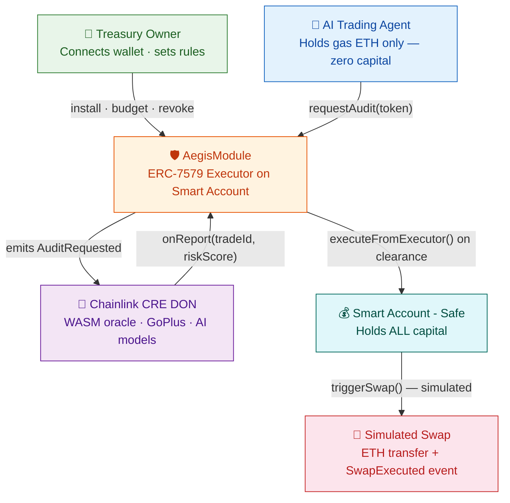
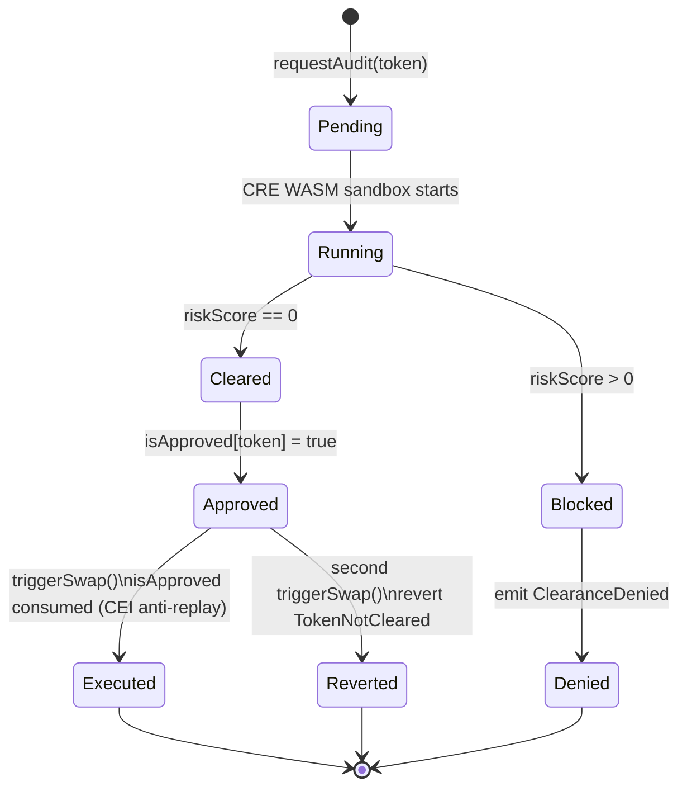
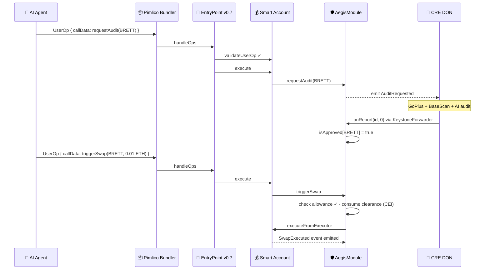
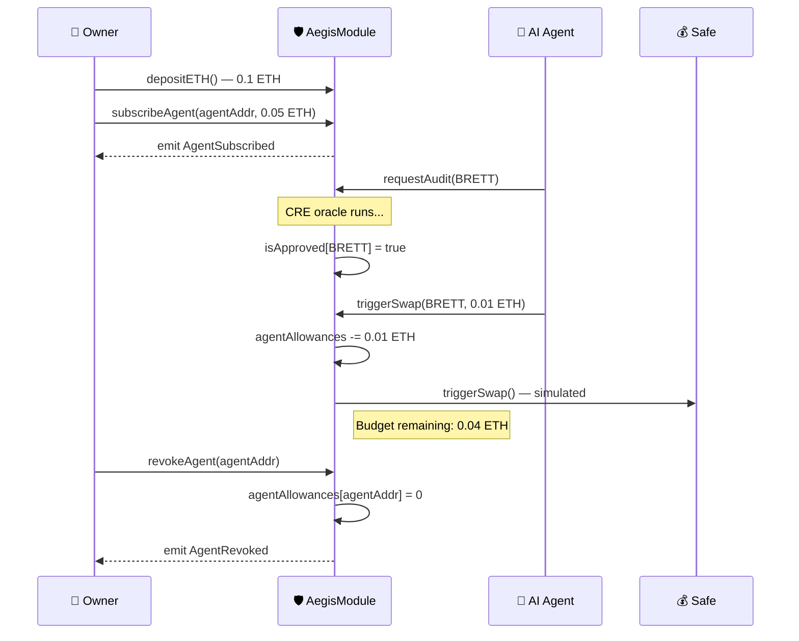
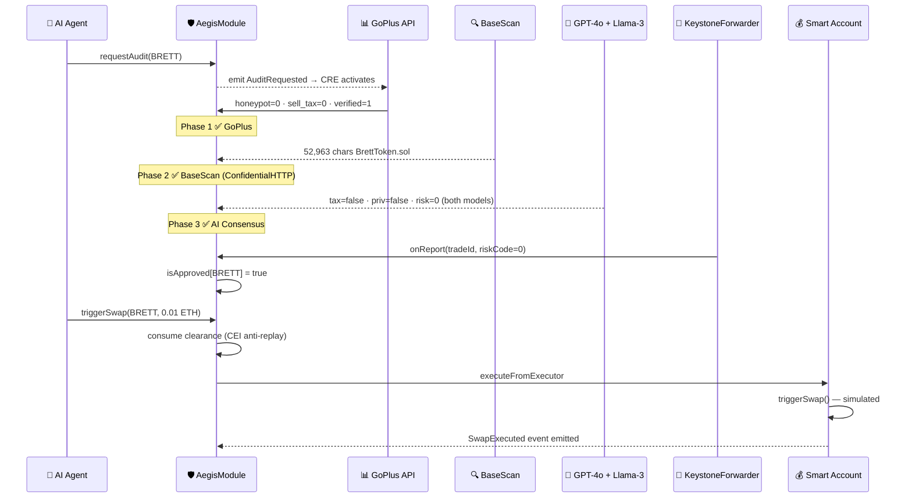
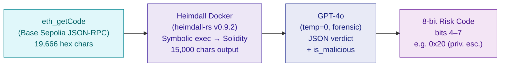

# Aegis Protocol V5 — System Architecture

> 7 Mermaid diagrams covering the core Aegis V5 security stack.

[🏠 Back to Main README](../README.md)

---

## 1. System Context

```mermaid
graph TD
    Owner["👤 Treasury Owner\nConnects wallet · sets rules"]
    Agent["🤖 AI Trading Agent\nHolds gas ETH only — zero capital"]
    Aegis["🛡️ AegisModule\nERC-7579 Executor on Smart Account"]
    CRE["🔗 Chainlink CRE DON\nWASM oracle · GoPlus · AI models"]
    SA["💰 Smart Account - Safe\nHolds ALL capital"]
    Swap["🔄 Simulated Swap\nETH transfer + SwapExecuted event"]

    Owner -->|"install · budget · revoke"| Aegis
    Agent -->|"requestAudit(token)"| Aegis
    Aegis -->|"emits AuditRequested"| CRE
    CRE -->|"onReport(tradeId, riskScore)"| Aegis
    Aegis -->|"executeFromExecutor() on clearance"| SA
    SA -->|"triggerSwap() — simulated"| Swap

    style Owner fill:#e8f5e9,stroke:#2e7d32,color:#1b5e20
    style Agent fill:#e3f2fd,stroke:#1565c0,color:#0d47a1
    style Aegis fill:#fff3e0,stroke:#e65100,color:#bf360c
    style CRE fill:#f3e5f5,stroke:#6a1b9a,color:#4a148c
    style SA fill:#e0f7fa,stroke:#00695c,color:#004d40
    style Swap fill:#fce4ec,stroke:#c62828,color:#b71c1c
```

---

## 2. CRE Oracle Pipeline

```mermaid
flowchart LR
    EVENT(["AuditRequested\ntradeId · token · config"])

    subgraph Phase1["Phase 1 — GoPlus"]
        GP1["GoPlus Security API\nlive on-chain data"]
        GP2["honeypot · sell restriction\nunverified · proxy → bits 0–3"]
    end

    subgraph Phase2["Phase 2 — Source Code"]
        BS1["BaseScan via ConfidentialHTTPClient\nAPI key sealed inside DON"]
        BS2["Full Solidity source\n(e.g. 52,963 chars BrettToken.sol)"]
    end

    subgraph Phase3["Phase 3 — AI Consensus"]
        AI1["GPT-4o reads source"]
        AI2["Llama-3 reads source"]
        AI3["Union of flags\nbits 4–7: tax · priv · extCall · bomb"]
    end

    REPORT(["onReport(tradeId, riskCode)\nvia KeystoneForwarder"])

    EVENT --> Phase1 --> GP1 --> GP2
    GP2 --> Phase2 --> BS1 --> BS2
    BS2 --> Phase3
    Phase3 --> AI1 & AI2 --> AI3 --> REPORT

    style EVENT fill:#fff3e0,stroke:#e65100,color:#bf360c
    style GP1 fill:#fffde7,stroke:#f9a825,color:#f57f17
    style GP2 fill:#fffde7,stroke:#f9a825,color:#f57f17
    style BS1 fill:#e0f7fa,stroke:#00838f,color:#006064
    style BS2 fill:#e0f7fa,stroke:#00838f,color:#006064
    style AI1 fill:#e8eaf6,stroke:#283593,color:#1a237e
    style AI2 fill:#fce4ec,stroke:#ad1457,color:#880e4f
    style AI3 fill:#f3e5f5,stroke:#6a1b9a,color:#4a148c
    style REPORT fill:#e8f5e9,stroke:#2e7d32,color:#1b5e20
```

---

## 3. Trade Lifecycle State Machine

```mermaid
stateDiagram-v2
    [*] --> Pending : requestAudit(token)
    Pending --> Running : CRE WASM sandbox starts
    Running --> Cleared : riskScore == 0
    Running --> Blocked : riskScore > 0
    Cleared --> Approved : isApproved[token] = true
    Blocked --> Denied : emit ClearanceDenied
    Approved --> Executed : triggerSwap()\nisApproved consumed (CEI anti-replay)
    Approved --> Reverted : second triggerSwap()\nrevert TokenNotCleared
    Executed --> [*]
    Denied --> [*]
    Reverted --> [*]
```

---

## 4. ERC-4337 Account Abstraction Flow

```mermaid
sequenceDiagram
    participant Bot as 🤖 AI Agent
    participant Bundler as 📦 Pimlico Bundler
    participant EP as 🔗 EntryPoint v0.7
    participant Safe as 💰 Smart Account
    participant AM as 🛡️ AegisModule
    participant CRE as 🔮 CRE DON

    Bot->>Bundler: UserOp { callData: requestAudit(BRETT) }
    Bundler->>EP: handleOps
    EP->>Safe: validateUserOp ✓
    EP->>Safe: execute
    Safe->>AM: requestAudit(BRETT)
    AM-->>CRE: emit AuditRequested

    Note over CRE: GoPlus + BaseScan + AI audit

    CRE->>AM: onReport(id, 0) via KeystoneForwarder
    AM->>AM: isApproved[BRETT] = true

    Bot->>Bundler: UserOp { callData: triggerSwap(BRETT, 0.01 ETH) }
    Bundler->>EP: handleOps
    EP->>Safe: execute
    Safe->>AM: triggerSwap
    AM->>AM: check allowance ✓ · consume clearance (CEI)
    AM->>Safe: executeFromExecutor
    Safe-->>AM: SwapExecuted event emitted
```

---

## 5. Agent Subscription Lifecycle

```mermaid
sequenceDiagram
    participant Owner as 👤 Owner
    participant AM as 🛡️ AegisModule
    participant Agent as 🤖 AI Agent
    participant Safe as 💰 Safe

    Owner->>AM: depositETH() — 0.1 ETH
    Owner->>AM: subscribeAgent(agentAddr, 0.05 ETH)
    AM-->>Owner: emit AgentSubscribed

    Agent->>AM: requestAudit(BRETT)
    Note over AM: CRE oracle runs...
    AM->>AM: isApproved[BRETT] = true

    Agent->>AM: triggerSwap(BRETT, 0.01 ETH)
    AM->>AM: agentAllowances -= 0.01 ETH
    AM->>Safe: triggerSwap() — simulated
    Note right of AM: Budget remaining: 0.04 ETH

    Owner->>AM: revokeAgent(agentAddr)
    AM->>AM: agentAllowances[agentAddr] = 0
    AM-->>Owner: emit AgentRevoked
```

---

## 6. End-to-End Happy Path

```mermaid
sequenceDiagram
    participant Agent as 🤖 AI Agent
    participant AM as 🛡️ AegisModule
    participant GP as 📊 GoPlus API
    participant BS as 🔍 BaseScan
    participant LLM as 🧠 GPT-4o + Llama-3
    participant KF as 🔑 KeystoneForwarder
    participant Safe as 💰 Smart Account

    Agent->>AM: requestAudit(BRETT)
    AM-->>GP: emit AuditRequested → CRE activates

    GP->>AM: honeypot=0 · sell_tax=0 · verified=1
    Note over AM: Phase 1 ✅ GoPlus

    BS-->>AM: 52,963 chars BrettToken.sol
    Note over AM: Phase 2 ✅ BaseScan (ConfidentialHTTP)

    LLM-->>AM: tax=false · priv=false · risk=0 (both models)
    Note over AM: Phase 3 ✅ AI Consensus

    KF->>AM: onReport(tradeId, riskCode=0)
    AM->>AM: isApproved[BRETT] = true

    Agent->>AM: triggerSwap(BRETT, 0.01 ETH)
    AM->>AM: consume clearance (CEI anti-replay)
    AM->>Safe: executeFromExecutor
    Safe->>Safe: triggerSwap() — simulated
    Safe-->>AM: SwapExecuted event emitted
```

---

## 7. Heimdall Bytecode Fallback Pipeline *(Experimental)*

> **Status: Standalone experimental demo.** This pipeline is not yet wired into the live CRE oracle. It demonstrates how Aegis could extend coverage to unverified contracts.

```mermaid
flowchart LR
    RPC["eth_getCode\n(Base Sepolia JSON-RPC)\n19,666 hex chars"]
    DECOMP["Heimdall Docker\n(heimdall-rs v0.9.2)\nSymbolic exec → Solidity\n15,000 chars output"]
    AI["GPT-4o\n(temp=0, forensic)\nJSON verdict\n+ is_malicious"]
    RISK["8-bit Risk Code\nbits 4–7\ne.g. 0x20 (priv. esc.)"]

    RPC --> DECOMP --> AI --> RISK

    style RPC fill:#e0f7fa,stroke:#00838f,color:#006064
    style DECOMP fill:#ede7f6,stroke:#4527a0,color:#311b92
    style AI fill:#e8eaf6,stroke:#283593,color:#1a237e
    style RISK fill:#f3e5f5,stroke:#6a1b9a,color:#4a148c
```
