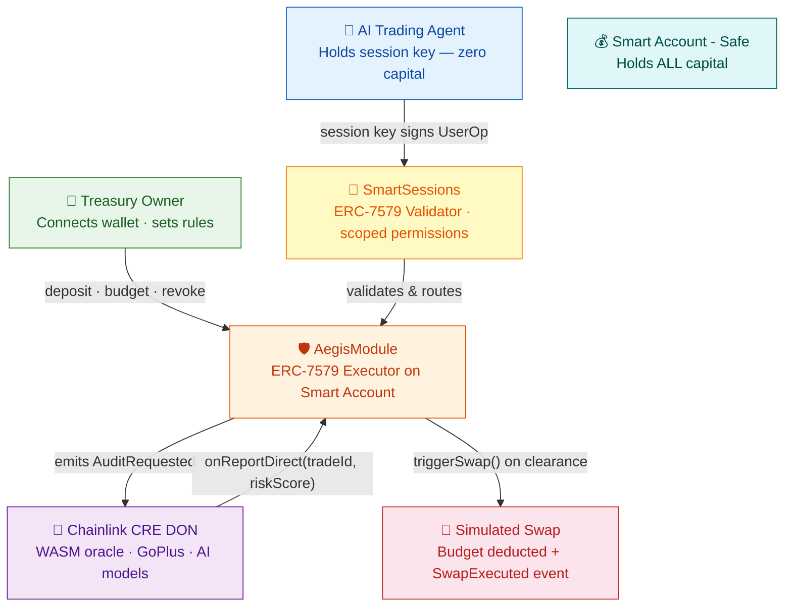
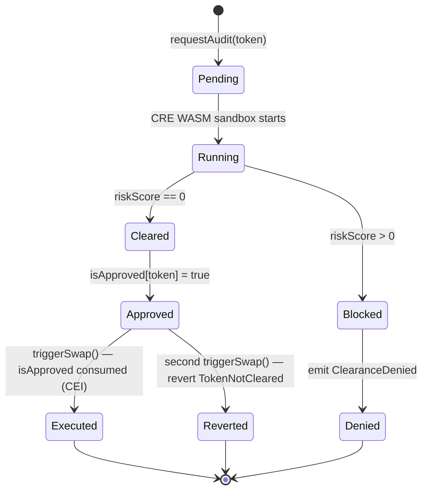
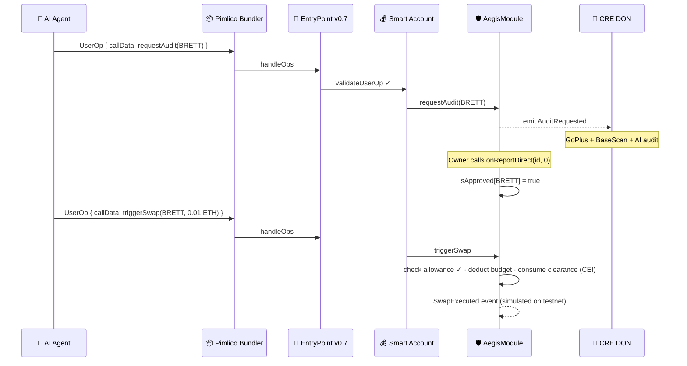
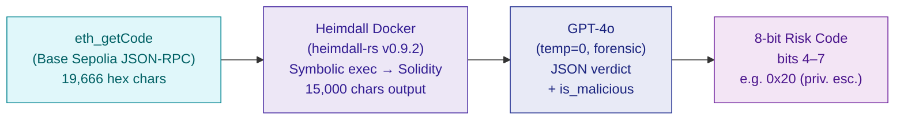

# Aegis Protocol V5 — System Architecture

[🏠 Back to Main README](../README.md)

---

## System Context

```mermaid
graph TD
    Owner["👤 Treasury Owner<br/>Connects wallet · sets rules"]
    Agent["🤖 AI Trading Agent<br/>Holds session key — zero capital"]
    Sessions["🔑 SmartSessions<br/>ERC-7579 Validator · scoped permissions"]
    Aegis["🛡️ AegisModule<br/>ERC-7579 Executor on Smart Account"]
    CRE["🔗 Chainlink CRE DON<br/>WASM oracle · GoPlus · AI models"]
    SA["💰 Smart Account - Safe<br/>Holds ALL capital"]
    Swap["🔄 Simulated Swap<br/>Budget deducted + SwapExecuted event"]

    Owner -->|"deposit · budget · revoke"| Aegis
    Agent -->|"session key signs UserOp"| Sessions
    Sessions -->|"validates & routes"| Aegis
    Aegis -->|"emits AuditRequested"| CRE
    CRE -->|"onReportDirect(tradeId, riskScore)"| Aegis
    Aegis -->|"triggerSwap() on clearance"| Swap

    style Owner fill:#e8f5e9,stroke:#2e7d32,color:#1b5e20
    style Agent fill:#e3f2fd,stroke:#1565c0,color:#0d47a1
    style Sessions fill:#fff9c4,stroke:#f57f17,color:#e65100
    style Aegis fill:#fff3e0,stroke:#e65100,color:#bf360c
    style CRE fill:#f3e5f5,stroke:#6a1b9a,color:#4a148c
    style SA fill:#e0f7fa,stroke:#00695c,color:#004d40
    style Swap fill:#fce4ec,stroke:#c62828,color:#b71c1c
```

---

## CRE Oracle Pipeline

```mermaid
flowchart LR
    EVENT(["AuditRequested<br/>tradeId · token · config"])

    subgraph Phase1["Phase 1 — GoPlus"]
        GP1["GoPlus Security API<br/>live on-chain data"]
        GP2["honeypot · sell restriction<br/>unverified · proxy → bits 0–3"]
    end

    subgraph Phase2["Phase 2 — Source Code"]
        BS1["BaseScan via ConfidentialHTTPClient<br/>API key sealed inside DON"]
        BS2["Full Solidity source<br/>(e.g. 52,963 chars BrettToken.sol)"]
    end

    subgraph Phase3["Phase 3 — AI Consensus"]
        AI1["GPT-4o reads source"]
        AI2["Llama-3 reads source"]
        AI3["Union of flags<br/>bits 4–7: tax · priv · extCall · bomb"]
    end

    REPORT(["onReportDirect(tradeId, riskCode)<br/>owner relay (production: KeystoneForwarder)"])

    EVENT --> Phase1 --> GP1 --> GP2
    GP2 --> Phase2 --> BS1 --> BS2
    BS2 --> Phase3
    Phase3 --> AI1 & AI2 --> AI3 --> REPORT

    style EVENT fill:#fff3e0,stroke:#e65100,color:#bf360c
    style GP1 fill:#fffde7,stroke:#f9a825,color:#f57f17
    style GP2 fill:#fffde7,stroke:#f9a825,color:#f57f17
    style BS1 fill:#e0f7fa,stroke:#00838f,color:#006064
    style BS2 fill:#e0f7fa,stroke:#00838f,color:#006064
    style AI1 fill:#e8eaf6,stroke:#283593,color:#1a237e
    style AI2 fill:#fce4ec,stroke:#ad1457,color:#880e4f
    style AI3 fill:#f3e5f5,stroke:#6a1b9a,color:#4a148c
    style REPORT fill:#e8f5e9,stroke:#2e7d32,color:#1b5e20
```

---

## Trade Lifecycle State Machine

```mermaid
stateDiagram-v2
    [*] --> Pending : requestAudit(token)
    Pending --> Running : CRE WASM sandbox starts
    Running --> Cleared : riskScore == 0
    Running --> Blocked : riskScore > 0
    Cleared --> Approved : isApproved[token] = true
    Blocked --> Denied : emit ClearanceDenied
    Approved --> Executed : triggerSwap() — isApproved consumed (CEI)
    Approved --> Reverted : second triggerSwap() — revert TokenNotCleared
    Executed --> [*]
    Denied --> [*]
    Reverted --> [*]
```

---

## ERC-4337 Account Abstraction Flow

```mermaid
sequenceDiagram
    participant Bot as 🤖 AI Agent
    participant Bundler as 📦 Pimlico Bundler
    participant EP as 🔗 EntryPoint v0.7
    participant Safe as 💰 Smart Account
    participant AM as 🛡️ AegisModule
    participant CRE as 🔮 CRE DON

    Bot->>Bundler: UserOp { callData: requestAudit(BRETT) }
    Bundler->>EP: handleOps
    EP->>Safe: validateUserOp ✓
    Safe->>AM: requestAudit(BRETT)
    AM-->>CRE: emit AuditRequested

    Note over CRE: GoPlus + BaseScan + AI audit

    Note over AM: Owner calls onReportDirect(id, 0)
    AM->>AM: isApproved[BRETT] = true

    Bot->>Bundler: UserOp { callData: triggerSwap(BRETT, 0.01 ETH) }
    Bundler->>EP: handleOps
    Safe->>AM: triggerSwap
    AM->>AM: check allowance ✓ · deduct budget · consume clearance (CEI)
    AM-->>AM: SwapExecuted event (simulated on testnet)
```

---

## Heimdall Bytecode Fallback Pipeline *(Experimental)*

> **Status: Standalone experimental demo.** This pipeline is not yet wired into the live CRE oracle. It demonstrates how Aegis could extend coverage to unverified contracts.

```mermaid
flowchart LR
    RPC["eth_getCode<br/>(Base Sepolia JSON-RPC)<br/>19,666 hex chars"]
    DECOMP["Heimdall Docker<br/>(heimdall-rs v0.9.2)<br/>Symbolic exec → Solidity<br/>15,000 chars output"]
    AI["GPT-4o<br/>(temp=0, forensic)<br/>JSON verdict<br/>+ is_malicious"]
    RISK["8-bit Risk Code<br/>bits 4–7<br/>e.g. 0x20 (priv. esc.)"]

    RPC --> DECOMP --> AI --> RISK

    style RPC fill:#e0f7fa,stroke:#00838f,color:#006064
    style DECOMP fill:#ede7f6,stroke:#4527a0,color:#311b92
    style AI fill:#e8eaf6,stroke:#283593,color:#1a237e
    style RISK fill:#f3e5f5,stroke:#6a1b9a,color:#4a148c
```
