# Aegis Protocol V4 — System Architecture

> 12 Mermaid diagrams covering all layers of the Aegis V4 stack.

---

## 1. System Context

---

## 2. AegisModule Internal Structure

```mermaid
graph LR
    subgraph Inputs
        A["agent: requestAudit(token)"]
        B["CRE: onReport(id, score)"]
        C["owner: subscribeAgent(addr, budget)"]
        D["owner: killSwitch()"]
    end

    subgraph AegisModule.sol
        direction TB
        TR["tradeRequests mapping\nid → token · agent"]
        AA["agentAllowances mapping\naddr → remaining budget"]
        IA["isApproved mapping\ntoken → bool"]
        PP["_processReport()\nriskScore == 0 → approve\nriskScore > 0 → deny"]
    end

    subgraph Outputs
        E["emit AuditRequested"]
        F["emit ClearanceUpdated / ClearanceDenied"]
        G["executeFromExecutor() → Uniswap"]
    end

    A --> TR --> E
    B --> PP --> IA --> F
    IA -->|"approved"| G
    C --> AA
    D -->|"zero all"| AA
```

---

## 3. CRE Oracle Pipeline

```mermaid
flowchart LR
    EVENT(["AuditRequested\ntradeId · token · config"])

    subgraph Phase1["Phase 1 — GoPlus"]
        GP1["GoPlus Security API\nlive on-chain data"]
        GP2["honeypot · sell restriction\nunverified · proxy → bits 0–3"]
    end

    subgraph Phase2["Phase 2 — Source Code"]
        BS1["BaseScan via ConfidentialHTTPClient\nAPI key sealed inside DON"]
        BS2["Full Solidity source\n(e.g. 52,963 chars BrettToken.sol)"]
    end

    subgraph Phase3["Phase 3 — AI Consensus"]
        AI1["GPT-4o reads source"]
        AI2["Llama-3 reads source"]
        AI3["Union of flags\nbits 4–7: tax · priv · extCall · bomb"]
    end

    REPORT(["onReport(tradeId, riskCode)\nvia KeystoneForwarder"])

    EVENT --> Phase1 --> GP1 --> GP2
    GP2 --> Phase2 --> BS1 --> BS2
    BS2 --> Phase3
    Phase3 --> AI1 & AI2 --> AI3 --> REPORT
```

---

## 4. Trade Lifecycle State Machine

---

## 5. ERC-4337 Account Abstraction Sequence

```mermaid
sequenceDiagram
    participant Bot as AI Agent
    participant Bundler as Pimlico Bundler
    participant EP as EntryPoint v0.7
    participant Safe as Smart Account
    participant AM as AegisModule
    participant CRE as CRE DON

    Bot->>Bundler: UserOp { callData: requestAudit(BRETT) }
    Bundler->>EP: handleOps
    EP->>Safe: validateUserOp ✓
    EP->>Safe: execute
    Safe->>AM: requestAudit(BRETT)
    AM-->>CRE: emit AuditRequested

    Note over CRE: GoPlus + BaseScan + AI audit

    CRE->>AM: onReport(id, 0) via KeystoneForwarder
    AM->>AM: isApproved[BRETT] = true

    Bot->>Bundler: UserOp { callData: triggerSwap(BRETT, 0.01 ETH) }
    Bundler->>EP: handleOps
    EP->>Safe: execute
    Safe->>AM: triggerSwap
    AM->>AM: check allowance ✓ · consume clearance (CEI)
    AM->>Safe: executeFromExecutor
    Safe->>Uniswap: exactInputSingle
    Uniswap-->>Safe: BRETT received
```

---

## 6. Multi-Agent Firewall — Demo 2

```mermaid
flowchart TD
    subgraph Agents
        NOVA["NOVA\n0.05 ETH budget"]
        CIPHER["CIPHER\n0.01 ETH budget"]
        REX["REX\n0.01 ETH budget"]
    end

    subgraph Oracle["Chainlink CRE runs for each token independently"]
        O1["BRETT\nGoPlus ✅ · AI ✅ → Risk Code 0"]
        O2["TaxToken\nAI reads hidden sell restriction → Risk Code 18"]
        O3["HoneypotCoin\nAI reads honeypot pattern → Risk Code 4"]
    end

    subgraph Results
        R1["✅ APPROVED\nNOVA executes Uniswap swap"]
        R2["🔴 BLOCKED\nCIPHER stands down"]
        R3["🔴 BLOCKED\nREX denied · bypass attempt reverts"]
    end

    NOVA -->|requestAudit| O1 --> R1
    CIPHER -->|requestAudit| O2 --> R2
    REX -->|requestAudit| O3 --> R3
```

---

## 7. Security Zone Architecture

---

## 8. 8-Bit Risk Matrix

```mermaid
graph LR
    subgraph GoPlus["GoPlus Output — Bits 0–3"]
        B0["Bit 0\nUnverified code\nis_open_source = 0"]
        B1["Bit 1\nSell restriction\nsell_tax > threshold"]
        B2["Bit 2\nHoneypot\nis_honeypot = 1"]
        B3["Bit 3\nUpgradeable proxy\nis_proxy = 1"]
    end

    subgraph AI["AI Consensus — Bits 4–7"]
        B4["Bit 4\nObfuscated tax\nhidden fee in source"]
        B5["Bit 5\nPrivilege escalation\nnon-standard Ownable"]
        B6["Bit 6\nExternal call risk\nreentrancy potential"]
        B7["Bit 7\nLogic bomb\ntime-gated malicious code"]
    end

    subgraph Verdict
        V0["riskCode == 0\nAll clear → APPROVED"]
        V1["riskCode > 0\nAny bit set → BLOCKED"]
    end

    B0 & B1 & B2 & B3 & B4 & B5 & B6 & B7 --> OR["Bitwise OR"]
    OR -->|"= 0"| V0
    OR -->|"> 0"| V1
```

---

## 9. Agent Subscription Lifecycle

```mermaid
sequenceDiagram
    participant Owner
    participant AM as AegisModule
    participant Agent as AI Agent

    Owner->>AM: depositETH() — 0.1 ETH
    Owner->>AM: subscribeAgent(agentAddr, 0.05 ETH)
    AM-->>Owner: emit AgentSubscribed

    Agent->>AM: requestAudit(BRETT)
    Note over AM: CRE oracle runs...
    AM->>AM: isApproved[BRETT] = true

    Agent->>AM: triggerSwap(BRETT, 0.01 ETH)
    AM->>AM: agentAllowances -= 0.01 ETH
    AM->>Uniswap: swap executes
    Note right of AM: Budget remaining: 0.04 ETH

    Owner->>AM: killSwitch()
    AM->>AM: agentAllowances[agentAddr] = 0
    AM-->>Owner: emit AgentRevoked
```

---

## 10. Tenderly VNet Development Loop

---

## 11. Frontend Architecture — Option B Command Center

```mermaid
graph TB
    subgraph Browser["Next.js App"]
        Header["Header: logo · VNet status · wallet · kill switch"]

        subgraph Left["Left Panel 60%"]
            Tabs["Tabs: Agents · Firewall · Audit Log · Marketplace"]
            AgTab["AgentsTab\nsubscribe · revoke · budget bars"]
            FwTab["FirewallTab\n8-bit risk toggles"]
            LogTab["AuditLogTab\nreal on-chain events"]
            MktTab["MarketplaceTab\npreset agent templates"]
        end

        subgraph Right["Right Panel 40% — Always Visible"]
            Feed["Oracle Feed\nSSE stream: GoPlus → AI → verdict"]
            Input["Audit Input\ntoken address → trigger CRE simulation"]
        end
    end

    subgraph API["API Routes"]
        Audit["/api/audit → CRE SSE stream"]
        Chat["/api/chat → LLM assistant"]
        Radar["/api/radar → on-chain events"]
    end

    AgTab & FwTab -->|"writeContract"| AM["AegisModule.sol"]
    LogTab --> Radar
    Feed --> Audit -->|"docker exec cre simulate"| CRE["CRE Oracle"]
    AM -->|"readContract"| AgTab & LogTab
```

---

## 12. End-to-End — Complete Happy Path

---

## Summary

| # | Diagram | Type |
|---|---|---|
| 1 | System Context | `graph TD` |
| 2 | Module Internal Structure | `graph LR` |
| 3 | CRE Oracle Pipeline | `flowchart LR` |
| 4 | Trade Lifecycle State Machine | `stateDiagram-v2` |
| 5 | ERC-4337 Account Abstraction | `sequenceDiagram` |
| 6 | Multi-Agent Firewall (Demo 2) | `flowchart TD` |
| 7 | Security Zone Architecture | `graph TB` |
| 8 | 8-Bit Risk Matrix | `graph LR` |
| 9 | Agent Subscription Lifecycle | `sequenceDiagram` |
| 10 | Tenderly Development Loop | `flowchart LR` |
| 11 | Frontend Architecture | `graph TB` |
| 12 | End-to-End Happy Path | `sequenceDiagram` |
