# Aegis Protocol V4 — System Architecture

> 12 Mermaid diagrams covering all layers of the Aegis V4 system: from the EVM smart contract through the Chainlink CRE DON, AI oracle pipeline, ERC-4337 account abstraction, agent lifecycle, and frontend.

---

## 1. System Context (C4 Level 1)

The highest-level view: who uses Aegis, what it connects to, and what it protects.

---

## 2. Module Architecture (C4 Level 2)

The internal structure of the AegisModule ERC-7579 executor.

---

## 3. Chainlink CRE Oracle Pipeline (Phase-by-Phase)

The 3-phase AI audit pipeline running inside the WASM sandbox.

---

## 4. Trade Lifecycle State Machine

Every trade request goes through a strict CEI (Checks-Effects-Interactions) state machine.

---

## 5. ERC-4337 Account Abstraction Flow

How the AI agent's trade intent reaches the smart account without holding capital.

---

## 6. Multi-Agent Firewall (Demo 2 — 3 Agents)

Three agents, three simultaneous trade intents, one oracle.

```mermaid
graph LR
    subgraph Agents
        NOVA["🤖 NOVA\n0.05 ETH budget"]
        CIPHER["🤖 CIPHER\n0.01 ETH budget"]
        REX["🤖 REX\n0.01 ETH budget"]
    end

    subgraph AegisModule
        Q0["tradeId=N\nBRETT"]
        Q1["tradeId=N+1\nTaxToken"]
        Q2["tradeId=N+2\nHoneypotCoin"]
    end

    subgraph CRE_Oracle["Chainlink CRE Oracle (runs for each)"]
        O0["BRETT audit\nGoPlus✅ BaseScan✅ AI✅\nRisk Code: 0"]
        O1["TaxToken audit\nMOCK source → AI reads sell restriction\nRisk Code: 18"]
        O2["HoneypotCoin audit\nMOCK source → AI reads honeypot\nRisk Code: 4"]
    end

    subgraph Verdicts
        V0["✅ ClearanceUpdated\nBRETT approved\nNOVA executes swap"]
        V1["🔴 ClearanceDenied\nTaxToken blocked\nCIPHER stands down"]
        V2["🔴 ClearanceDenied\nHoneypotCoin blocked\nREX denied + bypass reverts"]
    end

    NOVA -->|requestAudit| Q0 --> O0 --> V0
    CIPHER -->|requestAudit| Q1 --> O1 --> V1
    REX -->|requestAudit| Q2 --> O2 --> V2

    style V0 fill:#0f2a0f,stroke:#22c55e,color:#e2e8f0
    style V1 fill:#2a0f0f,stroke:#ef4444,color:#e2e8f0
    style V2 fill:#2a0f0f,stroke:#ef4444,color:#e2e8f0
```

---

## 7. Security Zone Architecture

Trust boundaries and the principle of zero custody.

---

## 8. 8-Bit Risk Matrix Encoding

How GoPlus and AI outputs are combined into a single risk code.

```mermaid
graph LR
    subgraph GoPlus["GoPlus Output"]
        G0["Bit 0: is_open_source=0\nunverified code"]
        G1["Bit 1: sell_tax > threshold\nor is_honeypot=1"]
        G2["Bit 2: is_honeypot=1"]
        G3["Bit 3: is_proxy=1"]
    end

    subgraph AI["AI Consensus (GPT-4o ∪ Llama-3)"]
        A4["Bit 4: obfuscated tax\nin source code"]
        A5["Bit 5: privilege escalation\n(NOT standard Ownable)"]
        A6["Bit 6: external call risk\n(reentrancy potential)"]
        A7["Bit 7: logic bomb\n(time-gated malicious logic)"]
    end

    subgraph Examples["Example Risk Codes"]
        E0["0x00 = 0\nAll clear → APPROVED"]
        E1["0x04 = 4\nBit 2 set → Honeypot → BLOCKED"]
        E2["0x12 = 18\nBit 1+4 set → Sell restriction + Tax → BLOCKED"]
        E3["0x05 = 5\nBit 0+2 set → Unverified + Honeypot → BLOCKED"]
    end

    G0 & G1 & G2 & G3 --> OR["Bitwise OR\n(any 1 = blocked)"]
    A4 & A5 & A6 & A7 --> OR
    OR --> Examples

    style OR fill:#0f172a,stroke:#06b6d4,color:#e2e8f0
    style E0 fill:#0f2a0f,stroke:#22c55e,color:#e2e8f0
    style E1 fill:#2a0f0f,stroke:#ef4444,color:#e2e8f0
    style E2 fill:#2a0f0f,stroke:#ef4444,color:#e2e8f0
    style E3 fill:#2a0f0f,stroke:#ef4444,color:#e2e8f0
```

---

## 9. Agent Subscription Lifecycle

How agents are onboarded, budgeted, and revoked.

---

## 10. Tenderly VNet Development Loop

The infrastructure loop for demos and development.

---

## 11. Frontend Architecture (V4 Command Center)

Option B: split-view dashboard with always-visible oracle feed.

---

## 12. End-to-End Sequence — Full Happy Path

The complete sequence from agent intent to on-chain swap with zero custody.

```mermaid
sequenceDiagram
    participant A as AI Agent
    participant UI as Aegis UI
    participant AM as AegisModule<br/>(ERC-7579)
    participant CRE as Chainlink CRE<br/>(WASM sandbox)
    participant GP as GoPlus API
    participant BS as BaseScan<br/>(via ConfidentialHTTP)
    participant LLM as GPT-4o + Llama-3
    participant KF as KeystoneForwarder
    participant SA as Smart Account
    participant UNI as Uniswap V3

    A->>AM: requestAudit(BRETT)
    AM->>AM: store tradeRequests[id] = {BRETT, agent}
    AM-->>CRE: emit AuditRequested(id, BRETT)
    UI->>UI: Oracle Feed activates (SSE stream)

    CRE->>GP: GET /token_security?address=BRETT
    GP-->>CRE: {honeypot:0, sell_tax:0, is_open_source:1}
    UI-->>UI: Phase 1 ✅ GoPlus

    CRE->>BS: GET /api?module=contract&action=getsourcecode<br/>(ConfidentialHTTPClient — key sealed in DON)
    BS-->>CRE: 52,963 chars of BrettToken.sol
    UI-->>UI: Phase 2 ✅ BaseScan

    CRE->>LLM: "Read this Solidity. Flag: tax, priv, extCall, bomb"
    LLM-->>CRE: {tax:false, priv:false, extCall:false, bomb:false} × 2 models
    UI-->>UI: Phase 3 ✅ AI Consensus

    CRE->>CRE: Risk Code = 0 (all bits clear)
    CRE->>KF: writeReport(tradeId, 0)
    KF->>AM: onReport(id, 0)
    AM->>AM: isApproved[BRETT] = true
    AM-->>UI: emit ClearanceUpdated(BRETT, true)
    UI-->>UI: ✅ Verdict: APPROVED — isApproved=TRUE

    A->>AM: triggerSwap(BRETT, 0.01 ETH)
    AM->>AM: check isApproved[BRETT] ✅
    AM->>AM: check agentAllowances[agent] ✅
    AM->>AM: isApproved[BRETT] = false (CEI anti-replay)
    AM->>SA: executeFromExecutor(UniswapCalldata)
    SA->>UNI: exactInputSingle({tokenIn:WETH, tokenOut:BRETT, amountIn:0.01 ETH})
    UNI-->>SA: BRETT tokens received
    AM-->>UI: emit SwapExecuted(BRETT, amountIn, amountOut)
    UI-->>UI: 🎉 Swap confirmed on Tenderly
```

---

## Summary Table

| Diagram | What It Shows |
|---|---|
| 1. System Context | Who uses Aegis, what it connects to |
| 2. Module Architecture | Internal AegisModule.sol structure |
| 3. CRE Oracle Pipeline | 3-phase AI audit (GoPlus → BaseScan → GPT-4o + Llama-3) |
| 4. Trade Lifecycle State Machine | requestAudit → CRE → approved/blocked → swap/revert |
| 5. ERC-4337 Account Abstraction | How agent UserOps reach the Smart Account |
| 6. Multi-Agent Firewall | 3 agents × 3 tokens × 1 oracle (Demo 2) |
| 7. Security Zone Architecture | Trust boundaries, ConfidentialHTTP, zero custody |
| 8. 8-Bit Risk Matrix | How GoPlus + AI bits combine into risk code |
| 9. Agent Subscription Lifecycle | subscribeAgent → budget → swap → killSwitch |
| 10. Tenderly Dev Loop | VNet provisioning, contract verification, CRE node |
| 11. Frontend Architecture | Next.js Command Center, split pane, API routes |
| 12. End-to-End Sequence | Complete happy path from agent intent to Uniswap swap |
