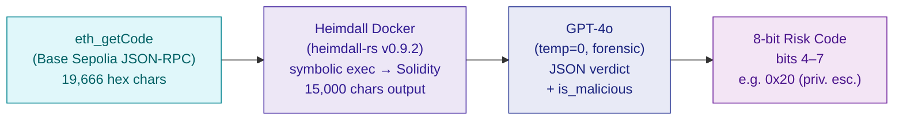

# Heimdall Bytecode Decompilation Pipeline

> **Status:** Standalone experimental demo · Proves Aegis can audit unverified contracts via bytecode alone

## The Problem: Unverified Contracts

Traditional DeFi security tools — including the core Aegis CRE oracle — require **verified source code** from BaseScan. When a token deploys without publishing its source, most firewalls **go blind**. The token gets blocked (Bit 0: "Unverified source"), but nobody knows _why_ it might be dangerous.

**This is a gap.** Malicious actors deliberately avoid verification to hide honeypots, hidden taxes, and privilege escalation backdoors.

## The Solution: Local Bytecode Decompilation

The Heimdall Pipeline proves Aegis can audit **any deployed contract** — even without source code — by reverse-engineering raw EVM bytecode into readable Solidity, then feeding it to an LLM for forensic analysis.



### Step-by-Step Pipeline

| Step | Component | What Happens | Output |
|---|---|---|---|
| **1** | `cast code` / `eth_getCode` | Fetch raw EVM bytecode from Base Sepolia via JSON-RPC | `0x6080604052...` (raw hex) |
| **2** | Heimdall Docker (`POST /decompile`) | Symbolic execution reconstructs function signatures, storage patterns, and control flow from opcodes | Solidity-like pseudocode |
| **3** | GPT-4o (temperature=0) | Specialized reverse-engineering prompt hunts for 5 vulnerability patterns in the decompiled output | Structured JSON verdict |
| **4** | Risk Encoder | Maps boolean flags to bits 4–7 of the standard 8-bit risk mask | Same format as verified pipeline |

### What GPT-4o Hunts For

The specialized prompt instructs the LLM to perform a **chain-of-thought analysis** looking for:

| Pattern | Description | Real-World Example |
|---|---|---|
| **Honeypot sell blocks** | `REVERT` in transfer path for non-allowlisted addresses | Owner-controlled `_allowedSellers` mapping |
| **Hidden minting** | `SSTORE` to total supply without proper access control | Uncapped `mint()` callable by owner |
| **Fee manipulation** | Transfer hooks that skim >5% via hidden storage slot reads | `_taxBasisPoints = 9900` (99% tax) |
| **Blocklisting** | Conditional `REVERT` based on sender/receiver address lookups | Blacklist mapping checked in `_update()` |
| **Unauthorized self-destruct** | `SELFDESTRUCT` or `DELEGATECALL` to owner-controlled proxy | Upgradeable proxy with hidden kill switch |

The output includes:
```json
{
  "obfuscatedTax": false,
  "privilegeEscalation": true,
  "externalCallRisk": false,
  "logicBomb": false,
  "is_malicious": true,
  "reasoning": "The contract restricts transfers to an owner-controlled allowlist..."
}
```

### Live Demo: MockHoneypot Detection

The demo script targets `MaliciousRugToken` (`0x99900d61...`) — a purpose-built malicious ERC20 deployed on Base Sepolia with 5 embedded vulnerabilities (95% hidden tax, selfdestruct, unlimited mint, blocklist, seller allowlist):

```
[Scene 2] BaseScan confirms: NO VERIFIED SOURCE CODE
         Traditional firewalls would STOP HERE.

[Scene 3] eth_getCode → 13,326 hex chars of raw bytecode

[Scene 4] Heimdall decompiles → 14,002 chars of Solidity-like pseudocode

[Scene 5] GPT-4o analyzes decompiled code:
  ⛔ VERDICT:             MALICIOUS
  🔴 obfuscatedTax:       TRUE
  🟢 privilegeEscalation: FALSE
  🟢 externalCallRisk:    FALSE
  🟢 logicBomb:           FALSE
  📊 8-Bit Risk Code: 1 (0b00000001) — is_malicious: true
  💬 "The contract contains a honeypot pattern where normal
      users are blocked from selling tokens"
```

> **Key insight:** GPT-4o correctly identifies the hidden tax and honeypot pattern from **decompiled bytecode alone** — no source code was ever published for this contract. The `MaliciousRugToken` source is in `src/MaliciousRugToken.sol` but was **never verified on BaseScan**, forcing the Heimdall fallback path.

### Key Advantages

| Feature | Heimdall Pipeline | Third-Party APIs |
|---|---|---|
| **Runs locally** | ✅ Docker container | ❌ External service |
| **No API keys for decompilation** | ✅ Heimdall is self-hosted | ❌ Requires authentication |
| **No rate limits on decompile** | ✅ Unlimited | ❌ Cloudflare blocks |
| **Confidential** | ✅ Bytecode stays local | ❌ Sent to third party |
| **Speed** | ~2 seconds typical | Variable |

> **Note:** The full pipeline requires Docker (for Heimdall) and an OpenAI API key (for GPT-4o analysis).

## Running It

### Prerequisites

```bash
# Build the Heimdall Docker image
docker build -t aegis-heimdall ./services/decompiler

# Start the container
docker run -d -p 8080:8080 --name aegis-heimdall aegis-heimdall

# Verify it's running
curl http://localhost:8080/health
# → { "status": "ok", "heimdall": "heimdall 0.9.2" }
```

### Demo Script

```powershell
# Default: decompiles MockHoneypot (malicious — triggers detection)
.\scripts\demo_v5_heimdall.ps1 -Interactive

# Custom target: any deployed contract address
.\scripts\demo_v5_heimdall.ps1 -TargetAddress 0x23EfaEF29EcC0e6CE313F0eEd3d5dA7E0f5Bcd89
```

> **Sample output:** [`sample_output/demo_v5_heimdall_run.txt`](sample_output/demo_v5_heimdall_run.txt)

### Live Integration Tests

```bash
npx jest test/cre/HeimdallLive.spec.ts
```

| Phase | Tests | What They Hit |
|---|---|---|
| **Phase 2** | Microservice | Health check, real decompilation, empty input rejection |
| **Phase 3** | Full pipeline | Base Sepolia RPC → Heimdall → structural assertions |
| **Phase 4** | End-to-end | Base Sepolia → Heimdall → live GPT-4o → valid risk JSON with `is_malicious` |

## Service Architecture

```
services/decompiler/
├── Dockerfile        # Multi-stage: rust:1.85 builder → debian:trixie runtime
├── server.js         # Express.js API (POST /decompile, GET /health)
├── package.json      # Dependencies (express only)
└── README.md         # Service-level documentation
```

The Docker image uses a multi-stage build:
1. **Builder stage** — Installs Rust toolchain and compiles heimdall-rs via bifrost
2. **Runtime stage** — Debian Trixie slim + Node.js 20 + the compiled heimdall binary

## Relationship to Core Aegis Pipeline

> **Important:** The Heimdall pipeline is a **standalone demonstration** and is **not wired into the live CRE oracle** (`cre-node/`). The core Aegis audit flow (triggered by `requestAudit()` on-chain) uses GoPlus + BaseScan + GPT-4o + Llama-3 without calling the Heimdall service.

The Heimdall pipeline answers: *"What would happen if we encountered an unverified contract?"* It proves the infrastructure exists to extend Aegis's coverage to **any deployed contract**, verified or not.

### Future Integration Path

To wire Heimdall into the live oracle, the CRE WASM entrypoint would:
1. Check if BaseScan returns empty source code
2. If empty, call `eth_getCode` and `POST /decompile` to the Heimdall service
3. Feed the decompiled output to the existing dual-LLM consensus layer (GPT-4o + Llama-3)

This would make the Heimdall fallback automatic and transparent to end users.
